# Arrays: Why They Exist, What They Are, and How They Work Internally

## 1. The Core Idea

An array is a data structure that stores multiple elements in a fixed order and gives each element a position called an index.

The most important idea behind an array is:

> If elements are stored next to each other in memory and every element has the same size, the computer can jump directly to any element using arithmetic.

That is why array access is usually:

```text
O(1)
```

This does not mean the computer searches for the element quickly. It means the computer does not search at all. It calculates the element's memory location.

Example:

```text
array = [10, 20, 30, 40, 50]
index = 3
array[3] = 40
```

Internally, the computer can calculate where `array[3]` lives using:

```text
address(array[3]) = base_address + index * element_size
```

That simple formula is the heart of arrays.

---

## 2. Why Arrays Came Into Existence

Before thinking about arrays, think about memory.

Computer memory is like a long sequence of numbered storage locations:

```text
address 1000 -> data
address 1001 -> data
address 1002 -> data
address 1003 -> data
...
```

Programs need to store groups of related values:

- Marks of students
- Prices of products
- Pixels of an image
- Characters of text
- Sensor readings
- Coordinates in a game
- Edges or weights in graph algorithms

Without arrays, storing many related values would be painful.

For example, storing 5 marks separately:

```text
mark1 = 91
mark2 = 82
mark3 = 77
mark4 = 89
mark5 = 95
```

This does not scale.

For 10,000 marks, we cannot sensibly create:

```text
mark1, mark2, mark3, ..., mark10000
```

Arrays solve this by giving one name to many indexed values:

```text
marks[0]
marks[1]
marks[2]
...
marks[9999]
```

The reasons arrays exist are:

- To store many related values under one name
- To keep values in a predictable order
- To access any position directly
- To process data using loops
- To match how computer memory naturally works
- To use memory compactly
- To help the CPU read nearby values efficiently

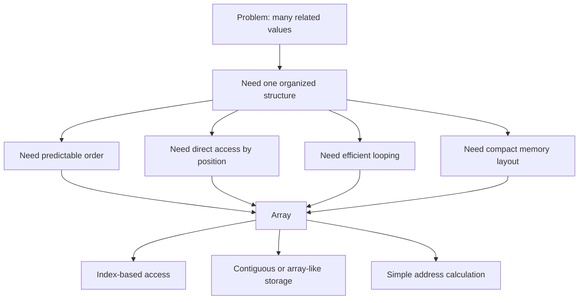

---

## 3. What an Array Is

At the abstract level, an array is:

> A finite ordered collection of elements, where each element can be accessed using an integer index.

The key properties are:

| Property | Meaning |
|---|---|
| Ordered | Elements have positions |
| Indexed | Each position has an index |
| Finite | The array has a length |
| Random access | Any index can be accessed directly |
| Usually homogeneous | Elements usually have the same type or same storage size |
| Usually contiguous internally | Elements are often stored next to each other in memory |

Example:

```text
Index:  0   1   2   3   4
Value: 10  20  30  40  50
```

Here:

```text
length = 5
first index = 0
last index = 4
```

The valid indexes are:

```text
0 <= index < length
```

For this array:

```text
0 <= index < 5
```

So valid indexes are:

```text
0, 1, 2, 3, 4
```

---

## 4. Abstract Array vs Real Implementation

The word "array" can mean two related things:

1. The abstract idea of indexed storage
2. The actual memory representation used by a machine or runtime

At the abstract level:

```text
A[i] means the element at position i
```

At the internal level:

```text
A[i] means calculate an address and read/write memory there
```

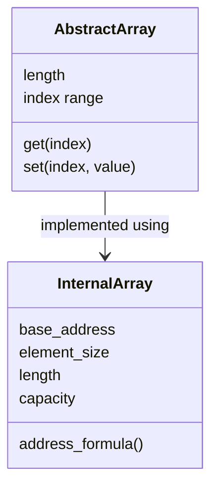

Important distinction:

| View | Focus |
|---|---|
| Abstract array | What operations mean |
| Internal array | How memory stores and finds elements |

Language-specific arrays may add features such as:

- Automatic bounds checking
- Dynamic resizing
- Type metadata
- Reference counting
- Garbage collection metadata
- Object headers
- Slices or views
- Copy-on-write behavior

But the fundamental array idea remains:

```text
index -> element position
```

---

## 5. The Internal Memory Model

A simple raw array has four important pieces of information:

| Internal detail | Meaning |
|---|---|
| Base address | Memory address where the first element starts |
| Element size | Number of bytes used by each element |
| Length | Number of valid elements |
| Index | Position of the element we want |

Example:

```text
base_address = 1000
element_size = 4 bytes
length = 5
```

Memory layout:

```text
Index:        0       1       2       3       4
Value:       10      20      30      40      50
Address:   1000    1004    1008    1012    1016
```

Why do addresses increase by 4?

Because each element occupies 4 bytes.

So:

```text
address(A[0]) = 1000 + 0 * 4 = 1000
address(A[1]) = 1000 + 1 * 4 = 1004
address(A[2]) = 1000 + 2 * 4 = 1008
address(A[3]) = 1000 + 3 * 4 = 1012
address(A[4]) = 1000 + 4 * 4 = 1016
```

This is why direct access is fast.

The machine does not move from element 0 to element 1 to element 2 to element 3.

It directly computes:

```text
base_address + index * element_size
```

---

## 6. Address Calculation

For a zero-based array:

```text
address(A[i]) = base_address + i * element_size
```

For an array whose first index is not zero:

```text
address(A[i]) = base_address + (i - lower_bound) * element_size
```

Example with lower bound 1:

```text
Index:  1   2   3   4   5
Value: 10  20  30  40  50
```

If:

```text
base_address = 1000
element_size = 4
lower_bound = 1
```

Then:

```text
address(A[1]) = 1000 + (1 - 1) * 4 = 1000
address(A[2]) = 1000 + (2 - 1) * 4 = 1004
address(A[5]) = 1000 + (5 - 1) * 4 = 1016
```

Zero-based indexing is common because it makes the formula simpler:

```text
address(A[i]) = base + i * size
```

The index is exactly the offset count from the first element.

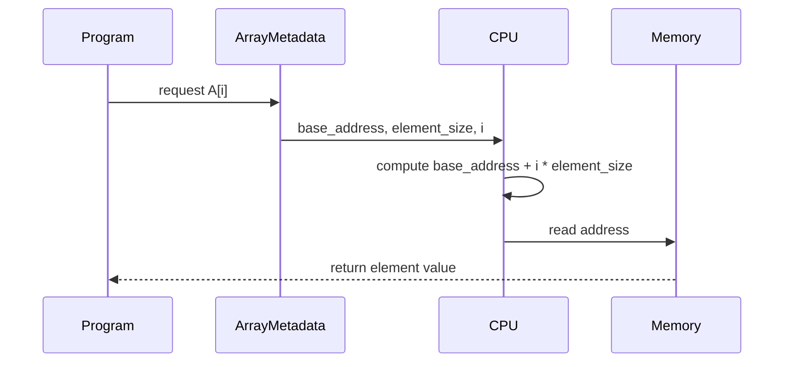

---

## 7. Index, Offset, Length, and Capacity

These terms are easy to mix up.

### 7.1 Index

The index is the logical position used by the programmer or algorithm.

Example:

```text
A[3]
```

Here `3` is the index.

---

### 7.2 Offset

The offset is how far the target element is from the first element.

For zero-based arrays:

```text
offset = index
```

For one-based arrays:

```text
offset = index - 1
```

For lower-bound arrays:

```text
offset = index - lower_bound
```

The memory formula uses the offset.

---

### 7.3 Length

Length is the number of elements currently considered part of the array.

Example:

```text
[10, 20, 30]
```

Length:

```text
3
```

Valid zero-based indexes:

```text
0, 1, 2
```

The last valid index is:

```text
length - 1
```

---

### 7.4 Capacity

Capacity is the amount of storage reserved internally.

Capacity matters most for dynamic arrays.

Example:

```text
values:   [10, 20, 30, _, _, _]
length:   3
capacity: 6
```

The first 3 slots contain valid elements.

The remaining 3 slots are reserved but unused.

This lets the array grow without allocating new memory on every append.

---

## 8. Static Arrays and Dynamic Arrays

Arrays come in two major conceptual forms:

| Type | Main idea |
|---|---|
| Static array | Size is fixed after creation |
| Dynamic array | Logical size can grow or shrink |

---

### 8.1 Static array

A static array has a fixed length.

Example:

```text
length = 5
array = [_, _, _, _, _]
```

Once created, it has exactly 5 slots.

You can change values:

```text
array[2] = 99
```

But you cannot simply add a sixth element unless new storage is created somewhere else.

Static arrays are simple and compact.

They are useful when:

- The size is known in advance
- Memory layout should be predictable
- Maximum performance and locality matter
- There is no need for frequent resizing

---

### 8.2 Dynamic array

A dynamic array gives the illusion that the array can grow.

Internally, it usually uses:

- A normal contiguous memory block
- A length
- A capacity
- A resizing strategy

Example:

```text
values:   [10, 20, 30, _, _, _]
length:   3
capacity: 6
```

If we append `40`:

```text
values:   [10, 20, 30, 40, _, _]
length:   4
capacity: 6
```

No new memory is needed because there was spare capacity.

If capacity is full:

```text
values:   [10, 20, 30, 40]
length:   4
capacity: 4
```

Appending another element may require:

1. Allocate a larger block
2. Copy old elements into the new block
3. Insert the new element
4. Release or abandon the old block depending on the memory model
5. Update internal metadata

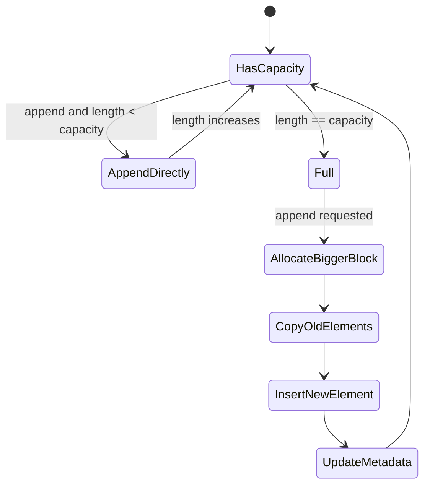

---

## 9. Why Dynamic Array Append Is Amortized O(1)

Appending to a dynamic array has two possible cases.

Case 1: there is free capacity.

```text
append = O(1)
```

Case 2: the internal storage is full.

```text
allocate bigger block + copy n elements + append = O(n)
```

So why do people say dynamic array append is `O(1)` amortized?

Because the expensive resize does not happen every time.

If the capacity grows by a multiplier, such as 2:

```text
capacity: 1 -> 2 -> 4 -> 8 -> 16 -> 32 -> ...
```

Then many cheap appends happen between expensive copies.

Across a long sequence of appends, the total copying cost spreads out.

For `n` appends:

```text
total work = O(n)
average per append = O(1)
```

That average over a sequence is called amortized cost.

Important:

```text
One append can still be O(n).
Many appends average to O(1) each.
```

---

## 10. Operations on Arrays

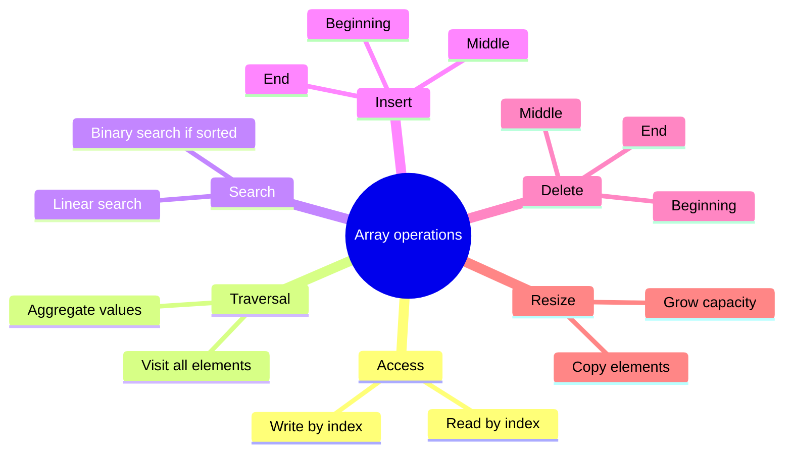

### 10.1 Read by index

Operation:

```text
value = A[i]
```

Internal steps:

1. Check whether `i` is valid if the runtime performs bounds checking
2. Compute the address using `base + i * element_size`
3. Read the value at that memory address
4. Return the value

Complexity:

```text
O(1)
```

---

### 10.2 Write by index

Operation:

```text
A[i] = value
```

Internal steps:

1. Check whether `i` is valid if bounds checking exists
2. Compute the target address
3. Store the new value there

Complexity:

```text
O(1)
```

Important:

Writing by index replaces an existing slot. It does not shift elements and it does not increase length.

---

### 10.3 Traversal

Traversal means visiting elements one by one.

Example:

```text
for i = 0 to length - 1:
    process A[i]
```

Every element is visited once.

Complexity:

```text
O(n)
```

Traversal is one of the array's strengths because elements are stored close together, which helps CPU caching.

---

### 10.4 Search in an unsorted array

If the array is not sorted, there is no position rule to help us.

Example:

```text
[42, 7, 91, 13, 5]
```

To find `13`, the algorithm may need to check each element.

Worst case:

```text
O(n)
```

Lower bound in the worst case:

```text
Omega(n)
```

Tight bound:

```text
Theta(n)
```

Reason:

If an element has not been checked, the target might still be there.

---

### 10.5 Search in a sorted array

If the array is sorted:

```text
[5, 7, 13, 42, 91]
```

Binary search can repeatedly discard half the remaining search space.

Complexity:

```text
O(log n)
```

Sorted arrays make searching faster, but insertion can become more expensive because order must be preserved.

---

### 10.6 Insert at the end

If there is spare capacity:

```text
[10, 20, 30, _, _]
append 40
[10, 20, 30, 40, _]
```

Complexity:

```text
O(1)
```

For dynamic arrays:

```text
O(1) amortized
```

because occasional resizing can cost `O(n)`.

---

### 10.7 Insert at the beginning or middle

To insert into the middle while preserving order, elements must shift right.

Example:

```text
Before:
Index:  0   1   2   3   4
Value: 10  20  30  40  50

Insert 99 at index 2:

Shift 50 right
Shift 40 right
Shift 30 right
Place 99 at index 2

After:
Index:  0   1   2   3   4   5
Value: 10  20  99  30  40  50
```

Why shift from right to left?

Because if we shift left to right, we overwrite values before copying them.

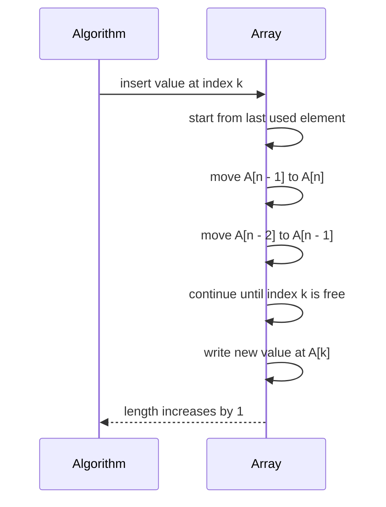

Worst-case complexity:

```text
O(n)
```

Insertion at the beginning is worst because every existing element shifts.

---

### 10.8 Delete from the end

Deleting the last element usually just decreases the length.

Example:

```text
[10, 20, 30, 40]
delete last
[10, 20, 30, _]
```

Complexity:

```text
O(1)
```

The old value may still physically exist in memory until overwritten, but it is no longer considered part of the logical array.

---

### 10.9 Delete from the beginning or middle

To delete while preserving order, elements after the deleted index shift left.

Example:

```text
Before:
[10, 20, 30, 40, 50]

Delete index 2:
[10, 20, 40, 50, _]
```

Complexity:

```text
O(n)
```

Reason:

Many elements may need to move.

---

### 10.10 Unordered deletion

If order does not matter, deletion can be faster.

To delete index `k`:

1. Copy the last element into position `k`
2. Decrease length

Example:

```text
Before:
[10, 20, 30, 40, 50]

Delete index 1 without preserving order:
[10, 50, 30, 40, _]
```

Complexity:

```text
O(1)
```

Tradeoff:

```text
Faster deletion, but original order is lost.
```

---

## 11. Complexity Summary

| Operation | Static array | Dynamic array | Why |
|---|---:|---:|---|
| Access by index | `O(1)` | `O(1)` | Address calculation |
| Update by index | `O(1)` | `O(1)` | Address calculation |
| Traverse all elements | `O(n)` | `O(n)` | Must visit each element |
| Search unsorted | `O(n)` | `O(n)` | No ordering rule |
| Search sorted | `O(log n)` | `O(log n)` | Binary search |
| Insert at end | Not growable directly | `O(1)` amortized | Spare capacity usually exists |
| Insert at beginning | `O(n)` if space exists | `O(n)` | Shift elements right |
| Insert in middle | `O(n)` if space exists | `O(n)` | Shift elements right |
| Delete at end | `O(1)` | `O(1)` | Decrease length |
| Delete at beginning | `O(n)` | `O(n)` | Shift elements left |
| Delete in middle | `O(n)` | `O(n)` | Shift elements left |

Important:

`O(1)` access is the main reason arrays are fundamental.

`O(n)` insertion and deletion in the middle is the main weakness of arrays.

---

## 12. What Happens During Access Internally

Suppose:

```text
A = [10, 20, 30, 40, 50]
base_address = 1000
element_size = 4
```

To access:

```text
A[3]
```

The internal process is:

1. Validate index if bounds checking is used
2. Compute offset:

```text
offset = 3
```

3. Compute byte distance:

```text
byte_distance = offset * element_size = 3 * 4 = 12
```

4. Compute final address:

```text
address = base_address + byte_distance = 1000 + 12 = 1012
```

5. Read memory at address `1012`

```text
value = 40
```

The important thing:

```text
A[3] does not require reading A[0], A[1], or A[2].
```

That is why it is called random access or direct access.

---

## 13. What Happens During Insertion Internally

Suppose we have:

```text
Index:  0   1   2   3   4   5
Value: 10  20  30  40  50  _
Length: 5
Capacity: 6
```

Insert `99` at index `2`.

Step 1: make room.

Shift from right to left:

```text
A[5] = A[4]
A[4] = A[3]
A[3] = A[2]
```

Now:

```text
Index:  0   1   2   3   4   5
Value: 10  20  30  30  40  50
```

Step 2: write new value:

```text
A[2] = 99
```

Now:

```text
Index:  0   1   2   3   4   5
Value: 10  20  99  30  40  50
```

Step 3: increase length:

```text
length = 6
```

Why does this cost `O(n)`?

Because in the worst case, inserting at index `0` requires moving every existing element.

---

## 14. What Happens During Deletion Internally

Suppose:

```text
Index:  0   1   2   3   4
Value: 10  20  30  40  50
Length: 5
```

Delete index `1`.

Step 1: shift left:

```text
A[1] = A[2]
A[2] = A[3]
A[3] = A[4]
```

Now:

```text
Index:  0   1   2   3   4
Value: 10  30  40  50  50
```

Step 2: decrease length:

```text
length = 4
```

Logical array:

```text
[10, 30, 40, 50]
```

The last physical slot may still contain old data:

```text
Index:  0   1   2   3   4
Value: 10  30  40  50  50
Logical: yes yes yes yes no
```

The final `50` is outside the logical length.

Some runtimes clear that slot to help memory management. Others leave it until overwritten.

---

## 15. Homogeneous Elements and Element Size

Raw arrays usually require every element to have the same size.

Why?

Because direct access depends on this formula:

```text
address(A[i]) = base + i * element_size
```

If every element has the same size, the machine can compute the address immediately.

If elements had different sizes:

```text
["a", "very long string", "mid"]
```

the computer could not jump directly to element 2 using a single multiplication unless it had extra offset information.

There are two common solutions:

1. Store fixed-size values directly
2. Store fixed-size references to values stored elsewhere

Example of fixed-size values:

```text
[10, 20, 30, 40]
```

Each integer may occupy the same number of bytes.

Example of references:

```text
array slots: [ref1, ref2, ref3]

ref1 -> "a"
ref2 -> "very long string"
ref3 -> "mid"
```

The array itself stores equal-sized references. The actual objects may have different sizes elsewhere in memory.

---

## 16. Array of Values vs Array of References

This distinction matters for performance and memory.

### 16.1 Array of values

The actual values are stored directly inside the array block.

Example:

```text
Array block:
[10][20][30][40]
```

Benefits:

- Compact storage
- Good cache locality
- Fewer memory jumps
- Predictable element size

Cost:

- Moving elements may copy full values
- Large values can make copying expensive

---

### 16.2 Array of references

The array stores references or addresses pointing to values elsewhere.

Example:

```text
Array block:
[refA][refB][refC]

refA -> object A
refB -> object B
refC -> object C
```

Benefits:

- Slots are fixed size
- Objects can have different sizes
- Moving array elements only moves references

Costs:

- Extra memory indirection
- Worse cache locality
- More memory overhead
- Possible fragmentation

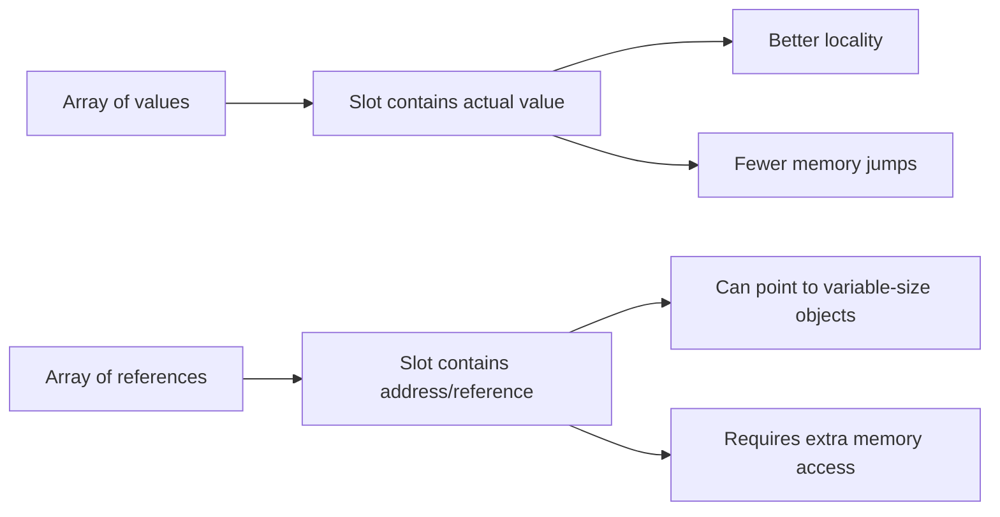

---

## 17. Contiguous Memory and Cache Locality

Arrays are fast not only because of `O(1)` indexing.

They are also fast because of how CPUs read memory.

Modern CPUs do not usually fetch just one byte or one value from memory. They fetch a block of nearby memory called a cache line.

Example:

```text
Memory:
[A0][A1][A2][A3][A4][A5][A6][A7]...

CPU reads A0.
Cache may also load A1, A2, A3, A4...
```

So when a program loops through an array:

```text
for i = 0 to n - 1:
    process A[i]
```

nearby elements are likely already in cache.

This is called spatial locality.

Arrays have excellent spatial locality because elements are next to each other.

Linked structures often have weaker locality because each node may live somewhere else in memory.

```text
Array:
[10][20][30][40][50]
close close close close close

Linked nodes:
[10|next] -> [20|next] -> [30|next]
may be far apart in memory
```

This is why arrays can beat theoretically similar structures in real performance.

---

## 18. Bounds Checking

An array has valid indexes.

For length `n` in zero-based indexing:

```text
0 <= index < n
```

If:

```text
length = 5
```

valid indexes are:

```text
0, 1, 2, 3, 4
```

Invalid indexes:

```text
-1, 5, 6, 100
```

Bounds checking means verifying that the index is valid before accessing memory.

Internal check:

```text
if index < 0 or index >= length:
    error
else:
    access element
```

Bounds checking protects against:

- Reading unrelated memory
- Writing over unrelated memory
- Corrupting data
- Security vulnerabilities
- Program crashes

Some systems always check bounds.

Some systems may not check bounds for performance reasons.

Some systems can remove bounds checks when they can prove the index is safe.

Even when bounds checking exists, array access is still considered:

```text
O(1)
```

because the check is constant-time.

---

## 19. Multidimensional Arrays

A multidimensional array stores data using more than one index.

Example:

```text
matrix[row][column]
```

Conceptually:

```text
[
  [1, 2, 3],
  [4, 5, 6],
  [7, 8, 9]
]
```

But physical memory is usually one-dimensional.

Memory is a line, not a table.

So a 2D array must be mapped into 1D memory.

---

### 19.1 Row-major order

In row-major order, each row is stored completely before the next row.

Matrix:

```text
1 2 3
4 5 6
7 8 9
```

Memory:

```text
[1][2][3][4][5][6][7][8][9]
```

Formula:

```text
address(A[r][c]) = base + ((r * number_of_columns) + c) * element_size
```

Example:

```text
A[2][1] in a 3-column matrix
linear_index = 2 * 3 + 1 = 7
```

So `A[2][1]` is stored at linear index `7`.

---

### 19.2 Column-major order

In column-major order, each column is stored completely before the next column.

Matrix:

```text
1 2 3
4 5 6
7 8 9
```

Memory:

```text
[1][4][7][2][5][8][3][6][9]
```

Formula:

```text
address(A[r][c]) = base + ((c * number_of_rows) + r) * element_size
```

Row-major and column-major are both valid. The important part is that the mapping rule must be consistent.

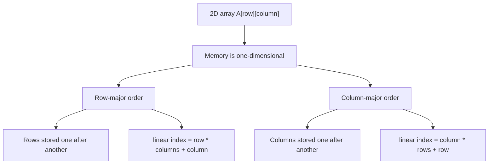

---

### 19.3 Stride

Stride means the number of memory positions we move to advance one step in a dimension.

For a row-major 2D array:

```text
A[row][column]
```

Moving one column forward changes the linear index by:

```text
1
```

Moving one row forward changes the linear index by:

```text
number_of_columns
```

So:

```text
row stride = number_of_columns
column stride = 1
```

Stride is important in:

- Matrix operations
- Image processing
- Scientific computing
- Tensor libraries
- Cache performance

---

### 19.4 Jagged arrays

A jagged array is an array of arrays where inner arrays can have different lengths.

Example:

```text
[
  [1, 2, 3],
  [4, 5],
  [6, 7, 8, 9]
]
```

This is not always stored as one rectangular contiguous block.

It may be stored as:

```text
outer array:
[ref_to_row0][ref_to_row1][ref_to_row2]

row0 -> [1][2][3]
row1 -> [4][5]
row2 -> [6][7][8][9]
```

Benefits:

- Rows can have different lengths
- Flexible structure

Costs:

- Extra references
- Weaker cache locality
- More memory allocations
- More indirection

---

## 20. Types of Arrays

Arrays can be classified in different ways depending on what property we are studying.

There is no single universal list because "type of array" can mean:

- Number of dimensions
- Whether size is fixed or growable
- Whether data is dense or sparse
- Whether rows have equal length
- Whether values are sorted
- Whether the array stores values or references
- Whether the array is used to represent a special matrix

This section organizes the major forms.

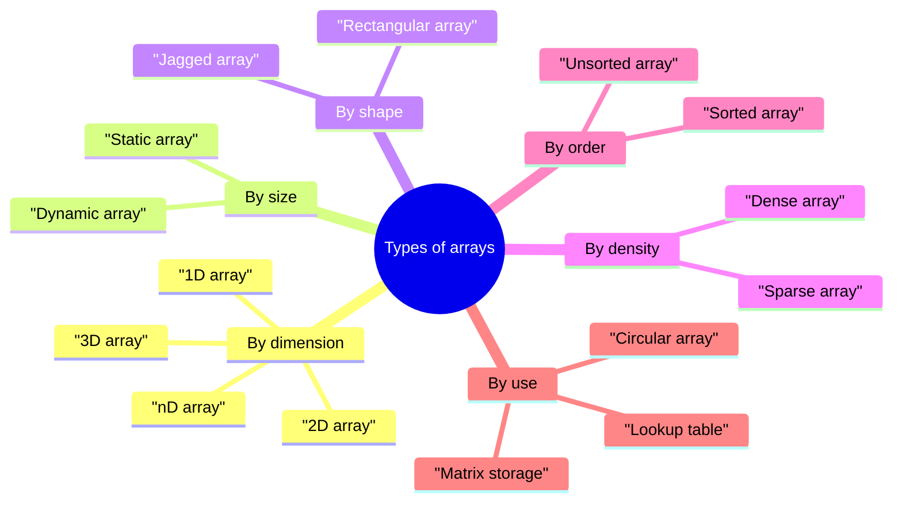

---

### 20.1 One-dimensional array

A one-dimensional array is a simple linear sequence.

Example:

```text
Index:  0   1   2   3   4
Value: 10  20  30  40  50
```

It has one index:

```text
A[i]
```

Address formula:

```text
address(A[i]) = base + i * element_size
```

If indexing starts at `lower_bound`:

```text
address(A[i]) = base + (i - lower_bound) * element_size
```

This is the simplest and most fundamental array form.

---

### 20.2 Two-dimensional rectangular array

A two-dimensional array uses two indexes:

```text
A[row][column]
```

Conceptually it looks like a table:

```text
row 0:  1  2  3
row 1:  4  5  6
row 2:  7  8  9
```

It has:

```text
number_of_rows = 3
number_of_columns = 3
```

Even though we draw it as a table, memory is still linear.

So the table must be flattened into a one-dimensional memory layout.

For row-major order:

```text
linear_index = row * number_of_columns + column
```

For column-major order:

```text
linear_index = column * number_of_rows + row
```

Then:

```text
address = base + linear_index * element_size
```

If row and column indexes do not start at `0`, subtract the lower bounds first.

For row-major order:

```text
linear_index = (row - row_lower_bound) * number_of_columns
             + (column - column_lower_bound)
```

You can also reverse the calculation.

For row-major order:

```text
row = linear_index / number_of_columns
column = linear_index mod number_of_columns
```

For column-major order:

```text
column = linear_index / number_of_rows
row = linear_index mod number_of_rows
```

Here `/` means integer division.

---

### 20.3 Three-dimensional array

A three-dimensional array uses three indexes:

```text
A[x][y][z]
```

You can imagine it as layers of 2D arrays.

Example dimensions:

```text
X = 2 layers
Y = 3 rows per layer
Z = 4 columns per row
```

Shape:

```text
2 x 3 x 4
```

Total elements:

```text
2 * 3 * 4 = 24
```

For row-major layout:

```text
linear_index = (x * Y * Z) + (y * Z) + z
```

Equivalent nested form:

```text
linear_index = ((x * Y) + y) * Z + z
```

Address:

```text
address(A[x][y][z]) = base + linear_index * element_size
```

Example:

```text
X = 2, Y = 3, Z = 4
A[1][2][3]

linear_index = (1 * 3 * 4) + (2 * 4) + 3
             = 12 + 8 + 3
             = 23
```

So `A[1][2][3]` is the 24th element in zero-based counting.

---

### 20.4 N-dimensional array

An N-dimensional array has any number of indexes:

```text
A[i1][i2][i3]...[ik]
```

If the dimensions are:

```text
D1, D2, D3, ..., Dk
```

then total elements are:

```text
D1 * D2 * D3 * ... * Dk
```

For row-major order, the linear index is:

```text
linear_index =
    i1 * (D2 * D3 * ... * Dk)
  + i2 * (D3 * D4 * ... * Dk)
  + i3 * (D4 * D5 * ... * Dk)
  + ...
  + ik
```

The multiplier for each dimension is its stride.

Example for 4D:

```text
A[a][b][c][d]
dimensions = A_size, B_size, C_size, D_size

linear_index =
    a * B_size * C_size * D_size
  + b * C_size * D_size
  + c * D_size
  + d
```

The address is always:

```text
base + linear_index * element_size
```

---

### 20.5 Rectangular array

A rectangular array has equal-length rows.

Example:

```text
[
  [1, 2, 3],
  [4, 5, 6],
  [7, 8, 9]
]
```

Every row has 3 elements.

Because the shape is regular, address calculation is simple.

For row-major order:

```text
linear_index = row * columns + column
```

Rectangular arrays are common for:

- Matrices
- Images
- Tables
- Dynamic programming grids
- Game boards

---

### 20.6 Jagged array

A jagged array is an array of arrays where rows can have different lengths.

Example:

```text
[
  [1, 2, 3],
  [4, 5],
  [6, 7, 8, 9]
]
```

This does not form a perfect rectangle.

Logical indexes still look like:

```text
A[row][column]
```

But internally, it may be:

```text
outer array:
[ref_to_row0][ref_to_row1][ref_to_row2]

row0: [1][2][3]
row1: [4][5]
row2: [6][7][8][9]
```

To access:

```text
A[2][3]
```

the system may first access row `2`, then access column `3` inside that row.

Jagged arrays are useful when rows naturally have different lengths, such as adjacency lists in graphs.

---

### 20.7 Static array

A static array has fixed length after creation.

Example:

```text
length = 5
[_, _, _, _, _]
```

It is useful when the number of elements is known ahead of time.

Strengths:

- Simple memory layout
- Low overhead
- Predictable size
- Fast indexing

Weakness:

- Cannot grow directly

---

### 20.8 Dynamic array

A dynamic array can grow logically.

Internally, it usually has:

```text
base pointer
length
capacity
```

Example:

```text
values:   [10, 20, 30, _, _, _]
length:   3
capacity: 6
```

It grows by allocating a larger block when capacity is full.

This is why append is:

```text
O(1) amortized
```

not always `O(1)` for every single append.

---

### 20.9 Dense array

A dense array stores most or all positions explicitly.

Example:

```text
[10, 20, 30, 40, 50]
```

For a dense matrix:

```text
1 2 3
4 5 6
7 8 9
```

every position stores a meaningful value.

Dense arrays are best when most positions are used.

---

### 20.10 Sparse array

A sparse array has many empty, zero, or default positions.

Example:

```text
Index:  0  1  2  3  4   5  6  7  8   9
Value:  0  0  0  0  99  0  0  0  0  12
```

Instead of storing every zero, we can store only meaningful entries:

```text
(4, 99)
(9, 12)
```

This saves memory when the number of meaningful entries is much smaller than the logical length.

Sparse arrays are explained in more detail in section 22.

---

### 20.11 Sorted array

A sorted array keeps elements in order.

Example:

```text
[5, 10, 20, 30, 40]
```

Strength:

```text
Binary search = O(log n)
```

Weakness:

```text
Insertion may be O(n)
```

because elements may need to shift to preserve sorted order.

Sorted arrays are good when searches are frequent and insertions are rare.

---

### 20.12 Unsorted array

An unsorted array has no ordering rule.

Example:

```text
[30, 5, 40, 10, 20]
```

Strength:

```text
Append at end can be O(1)
```

Weakness:

```text
Search is O(n)
```

because there is no ordering information to guide the search.

---

### 20.13 Circular array

A circular array treats the end as connected to the beginning.

It is useful for queues and buffers.

Formula:

```text
next_index = (current_index + 1) mod capacity
```

Circular arrays are explained in more detail later.

---

### 20.14 Parallel arrays

Parallel arrays store related fields in separate arrays using the same index.

Example:

```text
names:  ["Asha", "Ravi", "Mina"]
marks:  [91,     84,     77]
ages:   [19,     20,     18]
```

Index `1` refers to one logical record:

```text
name = "Ravi"
marks = 84
age = 20
```

This can be useful for compact storage and fast column-wise processing.

But it can become error-prone because all arrays must stay synchronized.

---

### 20.15 Array of structures vs structure of arrays

This is a storage-design idea, not tied to one language.

Array of structures:

```text
[
  {x: 1, y: 2},
  {x: 3, y: 4},
  {x: 5, y: 6}
]
```

Structure of arrays:

```text
x_values: [1, 3, 5]
y_values: [2, 4, 6]
```

Array of structures is often easier to understand when each record is processed as a whole.

Structure of arrays can be faster when processing one field across many records because memory access is more sequential.

---

## 21. Special Matrix Storage Using Arrays

Many array theory questions are really about matrices stored in arrays.

A matrix is a 2D structure:

```text
A[row][column]
```

A normal dense `n x n` matrix stores:

```text
n^2 elements
```

But many matrices have patterns:

- Only diagonal values matter
- Only lower triangle is used
- Only upper triangle is used
- Matrix is symmetric
- Most values are zero

When a pattern exists, we can avoid storing unnecessary values.

The idea is:

> Store only the meaningful part in a one-dimensional array, then use a formula to map logical matrix indexes to physical array indexes.

For every compressed matrix form, there are two steps:

```text
logical index  -> compressed array index -> memory address
```

That means:

```text
index = mapping_formula(row, column)
address = base + index * element_size
```

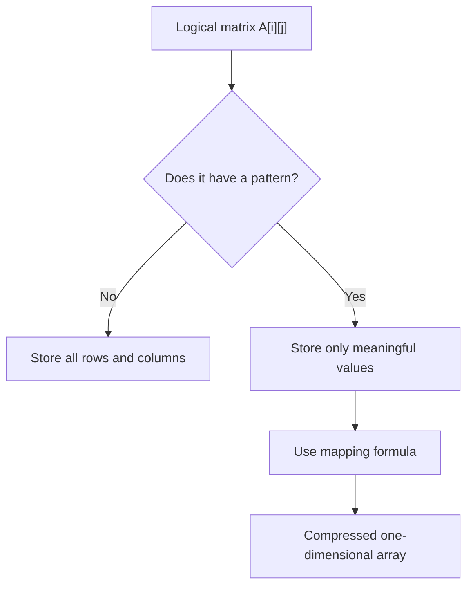

---

### 21.1 Dense matrix

A dense matrix stores every value.

Example:

```text
1 2 3
4 5 6
7 8 9
```

Storage needed:

```text
rows * columns
```

For an `n x n` matrix:

```text
n^2
```

If values are stored row-major:

```text
linear_index = row * columns + column
```

If values are stored column-major:

```text
linear_index = column * rows + row
```

---

### 21.2 Diagonal matrix

A diagonal matrix has non-zero values only where:

```text
row == column
```

Example:

```text
5 0 0 0
0 8 0 0
0 0 3 0
0 0 0 9
```

Only these values need storage:

```text
[5, 8, 3, 9]
```

Storage:

```text
n
```

instead of:

```text
n^2
```

Access rule:

```text
if row == column:
    return D[row]
else:
    return 0
```

Set rule:

```text
if row == column:
    D[row] = value
else:
    value must be 0, or the matrix is no longer diagonal
```

---

### 21.3 Lower triangular matrix

A lower triangular matrix stores meaningful values where:

```text
row >= column
```

Values above the main diagonal are zero.

Example:

```text
1 0 0 0
2 3 0 0
4 5 6 0
7 8 9 10
```

The stored part is:

```text
1
2 3
4 5 6
7 8 9 10
```

Number of stored elements:

```text
1 + 2 + 3 + ... + n = n(n + 1) / 2
```

For zero-based row-major compressed storage:

```text
if row >= column:
    index = row * (row + 1) / 2 + column
else:
    value = 0
```

Example:

```text
A[3][2]
index = 3 * (3 + 1) / 2 + 2
      = 3 * 4 / 2 + 2
      = 6 + 2
      = 8
```

So `A[3][2]` is stored at compressed array index `8`.

Mapping for `n = 4`:

```text
A[0][0] -> 0
A[1][0] -> 1    A[1][1] -> 2
A[2][0] -> 3    A[2][1] -> 4    A[2][2] -> 5
A[3][0] -> 6    A[3][1] -> 7    A[3][2] -> 8    A[3][3] -> 9
```

For one-based row-major textbook indexing:

```text
index = row * (row - 1) / 2 + column
```

where `row` and `column` start from `1`.

---

### 21.4 Upper triangular matrix

An upper triangular matrix stores meaningful values where:

```text
row <= column
```

Values below the main diagonal are zero.

Example:

```text
1 2 3 4
0 5 6 7
0 0 8 9
0 0 0 10
```

The stored part is:

```text
1 2 3 4
  5 6 7
    8 9
      10
```

Number of stored elements:

```text
n(n + 1) / 2
```

For zero-based row-major compressed storage:

```text
if row <= column:
    index = row * n - row * (row - 1) / 2 + (column - row)
else:
    value = 0
```

Why this works:

- Rows before `row` contain `n`, `n - 1`, `n - 2`, ... stored values.
- `(column - row)` is the offset inside the current row.

Example for `n = 4`:

```text
A[1][3]
index = 1 * 4 - 1 * 0 / 2 + (3 - 1)
      = 4 + 2
      = 6
```

Mapping for `n = 4`:

```text
A[0][0] -> 0    A[0][1] -> 1    A[0][2] -> 2    A[0][3] -> 3
                 A[1][1] -> 4    A[1][2] -> 5    A[1][3] -> 6
                                  A[2][2] -> 7    A[2][3] -> 8
                                                   A[3][3] -> 9
```

For one-based row-major textbook indexing:

```text
index = n * (row - 1) - (row - 2) * (row - 1) / 2 + (column - row + 1)
```

where `row` and `column` start from `1`.

---

#### Strict triangular variant

Sometimes "triangular matrix" includes the main diagonal.

Sometimes people discuss a strict triangular matrix, where the diagonal is also zero.

Strict lower triangular condition:

```text
row > column
```

Strict upper triangular condition:

```text
row < column
```

Storage needed:

```text
n(n - 1) / 2
```

For zero-based strict lower triangular row-major storage:

```text
if row > column:
    index = row * (row - 1) / 2 + column
else:
    value = 0
```

For zero-based strict upper triangular row-major storage:

```text
if row < column:
    index = row * (n - 1) - row * (row - 1) / 2 + (column - row - 1)
else:
    value = 0
```

---

### 21.5 Symmetric matrix

A symmetric matrix satisfies:

```text
A[row][column] = A[column][row]
```

Example:

```text
1 2 3
2 4 5
3 5 6
```

The upper triangle and lower triangle contain duplicate information.

So we only need to store one triangle.

Storage:

```text
n(n + 1) / 2
```

If we store the lower triangle using zero-based indexing:

```text
if row >= column:
    index = row * (row + 1) / 2 + column
else:
    index = column * (column + 1) / 2 + row
```

Example:

```text
A[0][2] = A[2][0]

index = 2 * (2 + 1) / 2 + 0
      = 3
```

So both `A[0][2]` and `A[2][0]` refer to the same stored value.

---

### 21.6 Skew-symmetric matrix

A skew-symmetric matrix satisfies:

```text
A[row][column] = -A[column][row]
```

The diagonal is always zero because:

```text
A[i][i] = -A[i][i]
```

This can only be true when:

```text
A[i][i] = 0
```

Example:

```text
 0   2  -3
-2   0   5
 3  -5   0
```

Only one triangle excluding the diagonal needs storage.

Storage:

```text
n(n - 1) / 2
```

Access idea:

```text
if row == column:
    return 0
if row > column:
    return stored_value(row, column)
if row < column:
    return -stored_value(column, row)
```

---

### 21.7 Tridiagonal matrix

A tridiagonal matrix has non-zero values only on:

- Main diagonal
- Diagonal just below the main diagonal
- Diagonal just above the main diagonal

Condition:

```text
abs(row - column) <= 1
```

Example:

```text
1 2 0 0
3 4 5 0
0 6 7 8
0 0 9 10
```

Storage needed:

```text
3n - 2
```

Why?

- Main diagonal has `n` elements
- Lower diagonal has `n - 1` elements
- Upper diagonal has `n - 1` elements

Total:

```text
n + (n - 1) + (n - 1) = 3n - 2
```

One simple storage layout:

```text
lower diagonal first, then main diagonal, then upper diagonal
```

For zero-based indexing:

```text
if row == column + 1:
    index = row - 1

if row == column:
    index = (n - 1) + row

if column == row + 1:
    index = (2n - 1) + row

if abs(row - column) > 1:
    value = 0
```

Example for `n = 4`:

```text
lower diagonal indexes: B[0..2]
main diagonal indexes:  B[3..6]
upper diagonal indexes: B[7..9]
```

---

### 21.8 Banded matrix

A banded matrix has non-zero values only near the main diagonal.

If the half-bandwidth is `b`, then:

```text
abs(row - column) <= b
```

Example with `b = 2`:

```text
x x x 0 0
x x x x 0
x x x x x
0 x x x x
0 0 x x x
```

Storage count for an `n x n` banded matrix with half-bandwidth `b`:

```text
n(2b + 1) - b(b + 1)
```

If we use a padded band storage layout, each row reserves `2b + 1` slots:

```text
band_column = column - row + b
```

Then:

```text
index = row * (2b + 1) + band_column
```

This padded version may store some unused edge slots, but the formula is simple.

---

### 21.9 Toeplitz matrix

A Toeplitz matrix has constant values along each diagonal.

Condition:

```text
A[row][column] depends only on column - row
```

Example:

```text
5 7 9 2
3 5 7 9
4 3 5 7
8 4 3 5
```

Each diagonal has one repeated value.

For an `n x n` Toeplitz matrix, storage needed:

```text
2n - 1
```

One mapping:

```text
index = (column - row) + (n - 1)
```

The `(n - 1)` offset keeps indexes non-negative.

Example for `n = 4`:

```text
A[2][0]
index = (0 - 2) + 3 = 1
```

---

### 21.10 Matrix storage summary

| Matrix type | Pattern | Storage needed |
|---|---|---:|
| Dense `n x n` | No special pattern | `n^2` |
| Diagonal | `row == column` | `n` |
| Lower triangular | `row >= column` | `n(n + 1) / 2` |
| Upper triangular | `row <= column` | `n(n + 1) / 2` |
| Strict lower triangular | `row > column` | `n(n - 1) / 2` |
| Strict upper triangular | `row < column` | `n(n - 1) / 2` |
| Symmetric | `A[i][j] = A[j][i]` | `n(n + 1) / 2` |
| Skew-symmetric | `A[i][j] = -A[j][i]` | `n(n - 1) / 2` |
| Tridiagonal | `abs(row - column) <= 1` | `3n - 2` |
| Banded | `abs(row - column) <= b` | `n(2b + 1) - b(b + 1)` |
| Toeplitz | constant diagonals | `2n - 1` |

The pattern decides the mapping formula.

---

## 22. Sparse Arrays and Sparse Matrices

The usual term is "sparse matrix", not "spare matrix".

A sparse array or sparse matrix is one where most positions contain a default value, usually `0`.

Example sparse matrix:

```text
0 0 5 0
7 0 0 0
0 8 0 9
```

This matrix has:

```text
rows = 3
columns = 4
total positions = 12
non-zero values = 4
```

The number of non-zero values is often called:

```text
nnz
```

meaning:

```text
number of non-zeros
```

For the example:

```text
nnz = 4
```

Dense storage would store all 12 values.

Sparse storage stores only the 4 useful values plus their positions.

---

### 22.1 Dense vs sparse storage

Dense representation:

```text
[
  [0, 0, 5, 0],
  [7, 0, 0, 0],
  [0, 8, 0, 9]
]
```

Sparse representation:

```text
(0, 2, 5)
(1, 0, 7)
(2, 1, 8)
(2, 3, 9)
```

Each triple means:

```text
(row, column, value)
```

Sparse storage is useful when:

```text
nnz << rows * columns
```

That means the number of meaningful values is much smaller than the total number of positions.

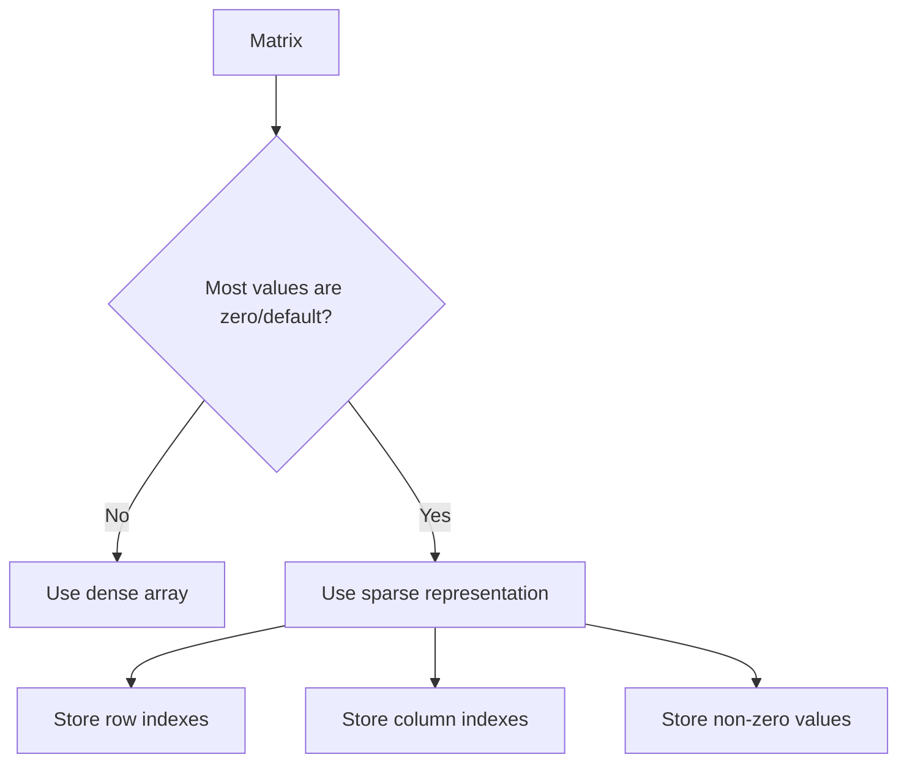

---

### 22.2 Coordinate list representation

Coordinate list is often called COO.

It stores three arrays:

```text
row_indexes
column_indexes
values
```

For:

```text
0 0 5 0
7 0 0 0
0 8 0 9
```

COO storage:

```text
row_indexes:    [0, 1, 2, 2]
column_indexes: [2, 0, 1, 3]
values:         [5, 7, 8, 9]
```

Entry `k` describes one non-zero value:

```text
row = row_indexes[k]
column = column_indexes[k]
value = values[k]
```

For `k = 2`:

```text
row = 2
column = 1
value = 8
```

So:

```text
A[2][1] = 8
```

COO is simple and good for building sparse matrices.

Weakness:

Looking up a specific value may require scanning the stored triples unless extra indexing is added.

---

### 22.3 Compressed Sparse Row representation

Compressed Sparse Row is often called CSR.

CSR is efficient when processing a matrix row by row.

It stores:

```text
values
column_indexes
row_pointers
```

For:

```text
0 0 5 0
7 0 0 0
0 8 0 9
```

CSR:

```text
values:         [5, 7, 8, 9]
column_indexes: [2, 0, 1, 3]
row_pointers:   [0, 1, 2, 4]
```

`row_pointers` has:

```text
rows + 1
```

entries.

For row `r`, non-zero entries are stored from:

```text
start = row_pointers[r]
end = row_pointers[r + 1]
```

The valid range is:

```text
start <= k < end
```

Example: row `2`.

```text
start = row_pointers[2] = 2
end = row_pointers[3] = 4
```

So row `2` uses:

```text
k = 2, 3
```

The entries are:

```text
column_indexes[2] = 1, values[2] = 8
column_indexes[3] = 3, values[3] = 9
```

So row `2` contains:

```text
A[2][1] = 8
A[2][3] = 9
```

CSR is strong for:

- Row traversal
- Matrix-vector multiplication
- Sparse linear algebra

---

### 22.4 Compressed Sparse Column representation

Compressed Sparse Column is often called CSC.

It is like CSR, but compressed by columns instead of rows.

It stores:

```text
values
row_indexes
column_pointers
```

CSC is efficient when processing a matrix column by column.

For column `c`, entries are stored from:

```text
start = column_pointers[c]
end = column_pointers[c + 1]
```

Use CSR when row operations are common.

Use CSC when column operations are common.

---

### 22.5 Dictionary-of-keys representation

Dictionary-of-keys is often called DOK.

It stores only non-zero values in a map-like structure:

```text
(row, column) -> value
```

Example:

```text
(0, 2) -> 5
(1, 0) -> 7
(2, 1) -> 8
(2, 3) -> 9
```

This is useful when many individual updates are needed.

Strength:

```text
easy insertion, deletion, and lookup by coordinate
```

Weakness:

```text
more overhead than compact array-based formats
```

---

### 22.6 Sparse matrix operation costs

Let:

```text
R = number of rows
C = number of columns
N = R * C
Z = number of non-zero values
```

Usually:

```text
Z = nnz
```

Dense storage:

```text
space = O(R * C)
```

Sparse storage:

```text
space = O(nnz)
```

plus index metadata.

Traversal of all logical positions:

```text
O(R * C)
```

Traversal of only non-zero values:

```text
O(nnz)
```

That is the main benefit.

---

### 22.7 When sparse storage is not good

Sparse storage is not automatically better.

If most values are non-zero, sparse storage may waste memory because it stores indexes as well as values.

Example:

Dense matrix with 100 values:

```text
store 100 values
```

Sparse COO with 100 non-zero values:

```text
store 100 row indexes
store 100 column indexes
store 100 values
```

That can be worse than dense storage.

Sparse storage is best when:

```text
nnz is much smaller than total positions
```

---

## 23. Arrays and Sorting

Arrays are commonly used for sorting because:

- Elements can be accessed by index
- Adjacent elements are easy to compare
- Swapping positions is direct
- Memory layout is compact
- Sequential scans are fast

Example operations used by sorting:

```text
compare A[i] and A[j]
swap A[i] and A[j]
scan from left to right
split by index
```

Different sorting algorithms interact with arrays differently:

| Algorithm | Array behavior |
|---|---|
| Bubble sort | Repeated adjacent comparisons |
| Selection sort | Repeated scanning and swapping |
| Insertion sort | Shifts elements right |
| Merge sort | Uses indexed splitting and merging |
| Quick sort | Uses partitioning by index |
| Heap sort | Treats array as a binary heap |

Arrays are especially important for heaps.

For a zero-based heap:

```text
parent(i) = (i - 1) / 2
left_child(i) = 2i + 1
right_child(i) = 2i + 2
```

This works because a complete binary tree can be stored compactly in array positions.

---

## 24. Arrays as Building Blocks

Many data structures are built using arrays internally.

Examples:

| Data structure | How arrays help |
|---|---|
| Dynamic array | Uses a resizable array block |
| String | Often stores characters in array-like memory |
| Stack | Can use array with push/pop at end |
| Queue | Can use circular array |
| Deque | Can use circular buffer or block arrays |
| Heap | Uses array indexes to represent tree relationships |
| Hash table | Uses an array of buckets |
| Matrix | Uses one-dimensional array storage internally |
| Graph adjacency matrix | Uses 2D array-like storage |

Arrays are fundamental because many higher-level structures depend on them.

---

## 25. Circular Arrays

A circular array uses a fixed block of memory as if the end connects back to the beginning.

This is useful for queues.

Example capacity:

```text
capacity = 5
indexes = 0, 1, 2, 3, 4
```

If we move forward from index 4, we wrap around to index 0.

Formula:

```text
next_index = (current_index + 1) mod capacity
```

Queue state:

```text
capacity: 5
front: 3
back: 1

Index: 0   1   2   3   4
Value: D   E   _   B   C
```

Logical queue order:

```text
B, C, D, E
```

The physical memory wraps around.

Circular arrays avoid shifting elements on every queue operation.

Complexities:

```text
enqueue = O(1)
dequeue = O(1)
```

if there is capacity.

---

## 26. Arrays vs Linked Lists

Arrays and linked lists are often compared because both store sequences.

| Feature | Array | Linked list |
|---|---|---|
| Access by index | `O(1)` | `O(n)` |
| Insert/delete at middle when position is known | `O(n)` due shifting | `O(1)` for relinking, but finding position may be `O(n)` |
| Memory layout | Contiguous or array-like | Nodes can be scattered |
| Cache locality | Usually strong | Usually weaker |
| Extra memory per element | Low | Higher because of links |
| Resizing | May require copying | Grows node by node |

Important:

Linked lists are not automatically faster for insertion.

If you only have an index, a linked list must first walk to that position:

```text
find position = O(n)
insert after node = O(1)
total = O(n)
```

Arrays are often faster in practice because of cache locality, even when both have `O(n)` behavior for some operations.

---

## 27. Internal Cost Details

### 27.1 Access cost

Array access usually includes:

```text
bounds check, if any
address calculation
memory load or store
```

This is constant-time:

```text
O(1)
```

But not all `O(1)` operations are equally fast.

An access that hits CPU cache is much faster than one that goes to main memory.

---

### 27.2 Shift cost

Insertion and deletion in the middle require moving elements.

If each element is small:

```text
copy cost is smaller
```

If each element is large:

```text
copy cost is larger
```

If the array stores references:

```text
shifting copies references, not full objects
```

Asymptotically, shifting `k` elements is:

```text
O(k)
```

Worst case:

```text
O(n)
```

---

### 27.3 Allocation cost

Dynamic array resizing requires a new memory block.

Allocation can be expensive because the memory manager may need to:

- Find a large enough free block
- Reserve memory
- Initialize metadata
- Copy old elements
- Update references or internal pointers
- Release old memory later

This is why dynamic arrays grow by more than one slot at a time.

Growing from capacity `n` to `n + 1` every time would make repeated appends expensive.

---

## 28. Common Mistakes and Misunderstandings

### 28.1 "Array access is O(1), so arrays are always fastest"

Not always.

Arrays are excellent for direct access and traversal.

But if you frequently insert or delete near the beginning, arrays can be expensive because elements shift.

---

### 28.2 "An array can always grow"

A raw fixed-size array cannot grow in place unless there is unused reserved space after it.

A dynamic array appears to grow because it may allocate a new larger block and copy elements.

---

### 28.3 "Deleting removes the physical value immediately"

Logical deletion usually means the length changes or elements shift.

The old physical bytes may remain until overwritten or cleared by the runtime.

---

### 28.4 "2D arrays are stored as real tables in memory"

Memory is linear.

2D arrays are mapped into one-dimensional memory using formulas such as row-major or column-major layout.

---

### 28.5 "O(1) means one CPU instruction"

No.

`O(1)` means the operation does not grow with input size.

It may still involve:

- Bounds checking
- Address arithmetic
- Cache lookup
- Memory access
- Type or runtime checks

---

### 28.6 "The index is the address"

The index is not the actual memory address.

The index is used to compute the address.

```text
address = base + index * element_size
```

---

### 28.7 "Sparse matrix and triangular matrix are the same thing"

They are not the same.

A triangular matrix has a specific geometric pattern:

```text
upper triangle or lower triangle
```

A sparse matrix only means most values are zero.

The non-zero values in a sparse matrix may appear anywhere.

---

### 28.8 "A matrix must always store rows times columns values"

Only a dense matrix must store every position directly.

Special matrices can use compressed storage:

```text
diagonal:      n values
triangular:    n(n + 1) / 2 values
tridiagonal:   3n - 2 values
sparse:        nnz values plus indexes
```

The logical matrix may still behave like a full matrix, but the physical storage can be smaller.

---

### 28.9 "Row-major and column-major give different matrix values"

They do not change the logical matrix.

They only change how the same values are arranged in memory.

The value of:

```text
A[row][column]
```

is the same logical value.

The address formula changes depending on the memory layout.

---

## 29. When Arrays Are a Good Choice

Arrays are a good choice when:

- You need fast access by index
- You know the size or can estimate it
- You mostly append at the end
- You frequently traverse all elements
- You need compact memory usage
- Cache performance matters
- Data is naturally ordered by position
- You want a simple structure with low overhead
- You need dense matrix or table storage

Examples:

- List of scores
- Pixel buffers
- Audio samples
- Matrices
- Dynamic programming tables
- Heaps
- Sorting buffers
- Lookup tables

---

## 30. When Arrays Are a Poor Choice

Arrays may be a poor choice when:

- Frequent insertion at the beginning is required
- Frequent deletion from the middle is required
- Size changes unpredictably and very often
- Data is extremely sparse
- A matrix has a special pattern that should be compressed
- Elements are naturally connected by relationships rather than positions
- You need fast lookup by key rather than by index

Better alternatives may include:

| Need | Possible alternative |
|---|---|
| Fast key lookup | Hash table |
| Sorted lookup and ordered traversal | Balanced tree |
| Frequent front insertion/deletion | Deque or linked structure |
| Sparse numeric data | Sparse matrix format |
| Graph relationships | Adjacency list |

---

## 31. The Most Important Internal Ideas

If you remember only a few things, remember these:

1. An array is an indexed sequence.
2. Direct access works because of address arithmetic.
3. The base address points to the first element.
4. Element size makes indexing possible.
5. `A[i]` becomes `base + i * element_size`.
6. Access and update are `O(1)`.
7. Searching unsorted arrays is `O(n)`.
8. Inserting or deleting in the middle is `O(n)` because elements shift.
9. Dynamic arrays use length and capacity.
10. Appending to a dynamic array is `O(1)` amortized.
11. Multidimensional arrays are mapped into one-dimensional memory.
12. Arrays are fast in practice because of cache locality.
13. Special matrices can be stored compactly with mapping formulas.
14. Sparse arrays store only meaningful values plus position information.

---

## 32. Final Summary

An array exists because programs need a simple, efficient way to store many related values in order.

At the abstract level, an array is an indexed collection.

At the internal level, a raw array is usually a contiguous block of memory where each element has a fixed size.

The core formula is:

```text
address(A[i]) = base_address + i * element_size
```

That formula explains why index access is:

```text
O(1)
```

Arrays are excellent for:

- Direct access
- Sequential traversal
- Compact storage
- Cache-friendly processing
- Building other data structures

Arrays are weaker for:

- Inserting in the middle
- Deleting from the middle
- Handling sparse data
- Growing without occasional copying

Arrays also explain many matrix storage techniques:

```text
dense matrix       -> store every value
diagonal matrix    -> store only diagonal
triangular matrix  -> store one triangle
sparse matrix      -> store only non-zero values and their positions
```

The deepest idea:

> Arrays are fast because they turn a logical position into a physical memory address using simple arithmetic.
