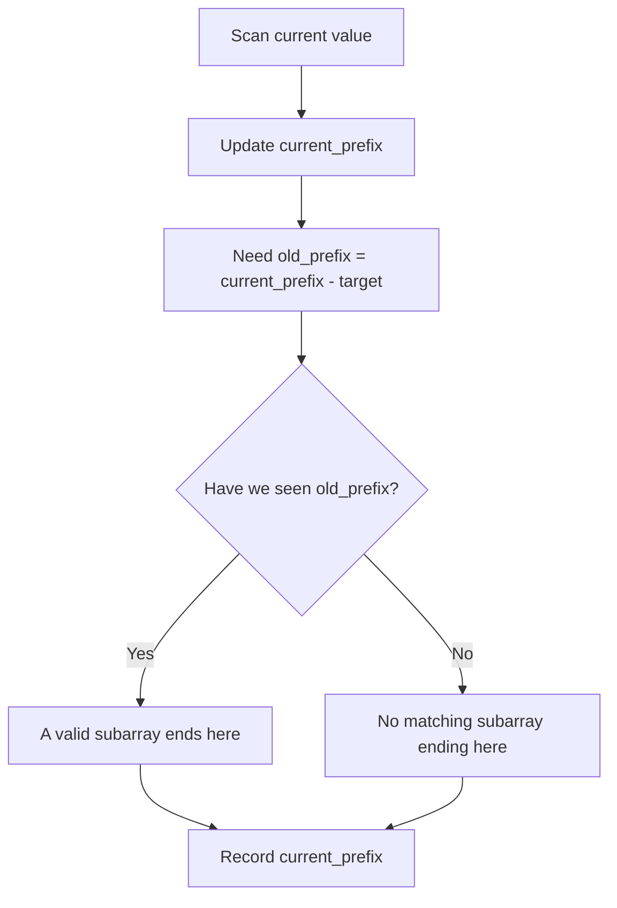

# Prefix Sum

Prefix sum means you keep the cumulative total from the beginning of the array up to each position.

It answers this question quickly:

```text
What is the sum of nums[left:right] without adding that range again?
```

## Visual Mental Model

Array:

```text
index:    0   1   2   3
nums:     3   4  -2   5
```

Prefix array:

```text
prefix[0] = 0
prefix[1] = nums[0] = 3
prefix[2] = nums[0] + nums[1] = 7
prefix[3] = nums[0] + nums[1] + nums[2] = 5
prefix[4] = nums[0] + nums[1] + nums[2] + nums[3] = 10

prefix: [0, 3, 7, 5, 10]
```

Range sum:

```text
sum nums[1:4] = nums[1] + nums[2] + nums[3]
              = 4 + -2 + 5
              = 7

Using prefix:
prefix[4] - prefix[1] = 10 - 3 = 7
```

Why subtraction works:

```text
prefix[4] = nums[0] + nums[1] + nums[2] + nums[3]
prefix[1] = nums[0]

prefix[4] - prefix[1]
= nums[1] + nums[2] + nums[3]
```

## The Important Mental Shift

For medium problems, prefix sum is usually not just an array of sums.

It becomes a way to remember previous states:

```text
current_prefix - old_prefix = target

Rearrange:
old_prefix = current_prefix - target
```

So while scanning, ask:

```text
Have I seen the prefix value I need before?
```

That is why prefix sum often combines with hashing.



## When To Use It

- The problem asks about subarray sums.
- Negative numbers are present, so sliding window may fail.
- You need to count subarrays with a target sum.
- You need to find whether a repeated cumulative state exists.
- You see divisibility or modulo conditions over subarray sums.

## When Not To Use It

- The array has only positive numbers and a simple sliding window is enough.
- The operation is not reversible. Sum is reversible because `range = prefix_right - prefix_left`.
- You need maximum/minimum over a range many times, where other structures may fit better.
- The problem is not about a contiguous range.

## Three Easy Warm-Up Questions

| No. | Question | Why It Helps |
|---|---|---|
| 1 | [Running Sum of 1d Array](https://leetcode.com/problems/running-sum-of-1d-array/) | Builds the basic cumulative sum idea. |
| 2 | [Find Pivot Index](https://leetcode.com/problems/find-pivot-index/) | Uses left sum and right sum reasoning. |
| 3 | [Range Sum Query - Immutable](https://leetcode.com/problems/range-sum-query-immutable/) | Shows why prefix arrays answer many range queries quickly. |

## Fully Worked Easy Example: Find Pivot Index

Problem idea: find an index where the sum on the left equals the sum on the right.

Input:

```text
nums = [1, 7, 3, 6, 5, 6]
total = 28
```

At index `i`:

```text
left_sum = sum before i
right_sum = total - left_sum - nums[i]
```

Dry run:

| i | nums[i] | left_sum before i | right_sum | Equal? |
|---|---:|---:|---:|---|
| 0 | 1 | 0 | 27 | No |
| 1 | 7 | 1 | 20 | No |
| 2 | 3 | 8 | 17 | No |
| 3 | 6 | 11 | 11 | Yes |

Python:

```python
from typing import List


class Solution:
    def pivotIndex(self, nums: List[int]) -> int:
        total = sum(nums)
        left_sum = 0

        for i, value in enumerate(nums):
            right_sum = total - left_sum - value
            if left_sum == right_sum:
                return i
            left_sum += value

        return -1
```

## Prefix Sum + Hashmap Template

Use this for exact subarray sum counting.

```python
from collections import defaultdict
from typing import List


def count_subarrays_with_sum(nums: List[int], target: int) -> int:
    seen = defaultdict(int)
    seen[0] = 1

    prefix = 0
    count = 0

    for value in nums:
        prefix += value
        count += seen[prefix - target]
        seen[prefix] += 1

    return count
```

## Sliding Window vs Prefix Sum

This is one of the most common confusions.

Use sliding window when:

```text
All numbers are positive, and expanding/shrinking changes the sum predictably.
```

Use prefix sum when:

```text
Negative numbers exist, or you need exact counts of many subarrays.
```

Example:

```text
nums = [1, -1, 1], target = 1
```

Sliding window struggles because adding `-1` decreases the sum. Prefix sum still works because it does not depend on monotonic growth.

## Common Mistakes

- Forgetting `seen[0] = 1`.
- Using a set when you need counts.
- Updating the hashmap before checking `prefix - target`, which can count an empty subarray incorrectly in some variations.
- Thinking prefix sum means only creating a prefix array. Many medium problems need prefix sum plus hashmap.

## Study Links

- [USACO Guide: Prefix Sums](https://usaco.guide/silver/prefix-sums)
- [LeetCode 75](https://leetcode.com/studyplan/leetcode-75/)
- [NeetCode Practice](https://neetcode.io/practice)
- [Wikipedia: Prefix Sum](https://en.wikipedia.org/wiki/Prefix_sum)

## Questions Using This Pattern

- [10. Product of Array Except Self](../practice/array/10-product-of-array-except-self.md)
- [11. Subarray Sum Equals K](../practice/array/11-subarray-sum-equals-k.md)
- [12. Continuous Subarray Sum](../practice/array/12-continuous-subarray-sum.md)
- [13. Contiguous Array](../practice/array/13-contiguous-array.md)
- [18. Minimum Operations to Reduce X to Zero](../practice/array/18-minimum-operations-to-reduce-x-to-zero.md)
