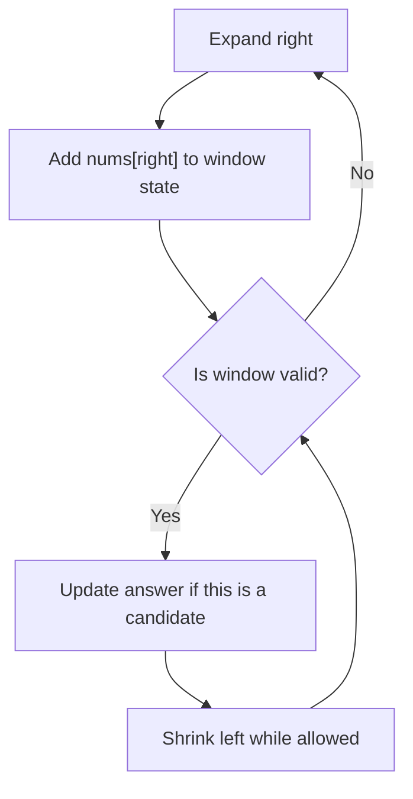

# Sliding Window

Sliding window is a two-pointer pattern for contiguous subarrays or substrings. The two pointers are not just two random indexes. They are the left and right boundary of a current window.

```text
window = nums[left : right + 1]
```

## Visual Mental Model

Fixed-size window:

```text
nums = [2, 1, 5, 1, 3, 2], k = 3

Window 1: [2, 1, 5]           sum = 8
Window 2:    [1, 5, 1]        sum = 7
Window 3:       [5, 1, 3]     sum = 9
Window 4:          [1, 3, 2]  sum = 6

Best fixed-size sum = 9
```

Variable-size window:

```text
nums = [2, 3, 1, 2, 4, 3], target = 7

left
 |
[2, 3, 1, 2, 4, 3]
          |
        right

current window = [2, 3, 1, 2]
sum = 8, valid because sum >= 7

Now shrink from left to see if a shorter valid window exists.
```

Window lifecycle:



## The Problem This Pattern Solves

Brute force repeats subarray work:

```text
start at every index
    build every subarray from that start
        recompute sum/count/frequency
```

Sliding window avoids recomputing because moving from one window to the next changes only two things:

```text
one element enters from the right
zero or more elements leave from the left
```

## When To Use It

- The problem asks for a contiguous subarray or substring.
- The answer is a longest, shortest, maximum, minimum, or count over a contiguous range.
- Adding the right element and removing the left element lets you update the state cheaply.
- The validity rule is monotonic: once invalid, moving left can restore validity.

## When Not To Use It

- Negative numbers break a sum-based monotonic rule.
- The selected elements do not need to be next to each other.
- You need to count arbitrary previous prefix states. Use prefix sum + hashmap.
- You cannot define what makes the current window valid.

Important distinction:

```text
Positive numbers + target sum at least K:
sliding window can work.

Mixed positive and negative numbers + exact sum K:
use prefix sum + hashmap.
```

## Three Easy Warm-Up Questions

| No. | Question | Why It Helps |
|---|---|---|
| 1 | [Maximum Average Subarray I](https://leetcode.com/problems/maximum-average-subarray-i/) | Fixed-size window with running sum. |
| 2 | [Contains Duplicate II](https://leetcode.com/problems/contains-duplicate-ii/) | Window of at most k distance with a set. |
| 3 | [Longest Nice Substring](https://leetcode.com/problems/longest-nice-substring/) | Helps think about substring constraints, even though it is often solved differently. |

If question 3 feels too string-specific, use [Find All Anagrams in a String](https://leetcode.com/problems/find-all-anagrams-in-a-string/) as the stronger frequency-window drill.

## Fully Worked Easy Example: Maximum Average Subarray I

Problem idea: given `nums` and `k`, find the maximum average of any subarray of length `k`.

Input:

```text
nums = [1, 12, -5, -6, 50, 3]
k = 4
```

Instead of recomputing every length-4 sum:

```text
Window 1: [1, 12, -5, -6]      sum = 2
Window 2:    [12, -5, -6, 50]  sum = 51
Window 3:        [-5, -6, 50, 3] sum = 42
```

To move from Window 1 to Window 2:

```text
old sum = 1 + 12 + -5 + -6 = 2
remove nums[0] = 1
add nums[4] = 50
new sum = 2 - 1 + 50 = 51
```

Dry run:

| Step | Window | Sum | Best Sum | Why |
|---|---|---:|---:|---|
| 1 | [1, 12, -5, -6] | 2 | 2 | First full window. |
| 2 | [12, -5, -6, 50] | 51 | 51 | Remove 1, add 50. |
| 3 | [-5, -6, 50, 3] | 42 | 51 | Remove 12, add 3. |

Python:

```python
from typing import List


class Solution:
    def findMaxAverage(self, nums: List[int], k: int) -> float:
        current = sum(nums[:k])
        best = current

        for right in range(k, len(nums)):
            current += nums[right]
            current -= nums[right - k]
            best = max(best, current)

        return best / k
```

## Variable Window Template

Use this when the window size is not fixed.

```python
from typing import List


def longest_window_with_at_most_k_zeros(nums: List[int], k: int) -> int:
    left = 0
    zeros = 0
    best = 0

    for right, value in enumerate(nums):
        if value == 0:
            zeros += 1

        while zeros > k:
            if nums[left] == 0:
                zeros -= 1
            left += 1

        best = max(best, right - left + 1)

    return best
```

## How To Recognize It In Medium Problems

Look for:

- "subarray"
- "substring"
- "consecutive"
- "at most k"
- "at least target"
- "longest"
- "minimum length"
- "window"

Then write:

```text
Window state:
Validity condition:
When to expand:
When to shrink:
When to update answer:
```

## Common Mistakes

- Using sliding window when negative numbers make the sum unpredictable.
- Updating the answer before the window is valid.
- Shrinking only once when the window may still be invalid.
- Forgetting that every valid window ending at `right` may contribute many subarrays in counting problems.

## Study Links

- [NeetCode Practice](https://neetcode.io/practice)
- [LeetCode 75](https://leetcode.com/studyplan/leetcode-75/)
- [USACO Guide: Two Pointers](https://usaco.guide/silver/two-pointers)
- [GeeksforGeeks: Short Notes on Two Pointer and Sliding Window](https://www.geeksforgeeks.org/dsa/short-notes-on-two-pointer-and-sliding-window-1/)

## Questions Using This Pattern

- [14. Minimum Size Subarray Sum](../practice/array/14-minimum-size-subarray-sum.md)
- [15. Subarray Product Less Than K](../practice/array/15-subarray-product-less-than-k.md)
- [16. Fruit Into Baskets](../practice/array/16-fruit-into-baskets.md)
- [17. Max Consecutive Ones III](../practice/array/17-max-consecutive-ones-iii.md)
- [18. Minimum Operations to Reduce X to Zero](../practice/array/18-minimum-operations-to-reduce-x-to-zero.md)
