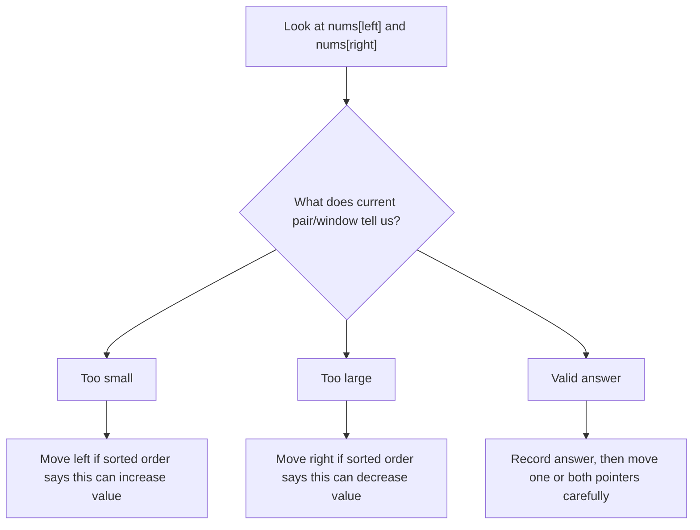

# Two Pointers

Two pointers means you use two indexes to look at two useful positions in an array. The power is not the two variables. The power is the rule that tells you which pointer can move safely.

## Visual Mental Model

Opposite direction:

```text
index:  0   1   2   3   4   5
value:  1   3   4   6   8   10
        L                   R

Current pair = nums[L] + nums[R]

If sum is too small:
move L right because that is the only way to increase the sum.

If sum is too large:
move R left because that is the only way to decrease the sum.
```

Same direction:

```text
read scans every value
write marks the next position in the valid prefix

index:  0   1   2   3   4   5
value:  0   0   1   1   2   2
        W       R

nums[0:W] is already valid.
nums[R] is the current value being inspected.
```

Pointer decision flow:



## The Problem This Pattern Solves

Brute force often checks every pair:

```text
for i in range(n):
    for j in range(i + 1, n):
        check nums[i], nums[j]
```

That is O(n^2). Two pointers avoids checking pairs that cannot possibly help.

The pattern works only when you can say:

```text
After this comparison, all pairs on one side are useless.
```

If you cannot explain which candidates are eliminated, you are probably forcing the pattern.

## When To Use It

- The question asks about pairs, triplets, boundaries, palindromes, or in-place compaction.
- The array is sorted, or sorting does not break the answer.
- One comparison gives a safe pointer move.
- You can describe what the left pointer and right pointer mean in plain English.

## When Not To Use It

- You need arbitrary previous values with no order relationship. Use hashing.
- The chosen values do not have a boundary relationship.
- Moving a pointer might skip a value that could become useful later.
- The problem asks for all subsets, permutations, or combinations without a sorted pruning rule.

## Three Easy Warm-Up Questions

Do these before medium two-pointer questions.

| No. | Question | Why It Helps |
|---|---|---|
| 1 | [Valid Palindrome](https://leetcode.com/problems/valid-palindrome/) | Teaches opposite-end movement with character comparison. |
| 2 | [Move Zeroes](https://leetcode.com/problems/move-zeroes/) | Teaches read/write pointers for in-place compaction. |
| 3 | [Squares of a Sorted Array](https://leetcode.com/problems/squares-of-a-sorted-array/) | Teaches opposite-end comparison when larger absolute values may be on either side. |

## Fully Worked Easy Example: Valid Palindrome

Goal: check whether a string reads the same from both sides after ignoring non-alphanumeric characters and case.

Input:

```text
"A man, a plan, a canal: Panama"
```

Mental model:

```text
A man, a plan, a canal: Panama
L                              R
```

Dry run:

| Step | left char | right char | Decision | Why |
|---|---|---|---|---|
| 1 | A | a | Match after lowercase | Move both pointers inward. |
| 2 | space | m | Skip left | Spaces do not matter. |
| 3 | m | m | Match | Move both pointers inward. |
| 4 | a | a | Match | Move both pointers inward. |
| 5 | n | n | Match | Continue until pointers cross. |

Python:

```python
class Solution:
    def isPalindrome(self, s: str) -> bool:
        left, right = 0, len(s) - 1

        while left < right:
            while left < right and not s[left].isalnum():
                left += 1
            while left < right and not s[right].isalnum():
                right -= 1

            if s[left].lower() != s[right].lower():
                return False

            left += 1
            right -= 1

        return True
```

Why this is two pointers:

- `left` represents the next meaningful character from the start.
- `right` represents the next meaningful character from the end.
- If the characters differ, no later move can fix that mismatch.
- If they match, both positions are solved and can be discarded.

## Python Templates

Opposite direction:

```python
from typing import List


def two_sum_sorted(nums: List[int], target: int) -> list[int]:
    left, right = 0, len(nums) - 1

    while left < right:
        current = nums[left] + nums[right]

        if current == target:
            return [left, right]
        if current < target:
            left += 1
        else:
            right -= 1

    return []
```

Read/write compaction:

```python
from typing import List


def move_zeroes(nums: List[int]) -> None:
    write = 0

    for read in range(len(nums)):
        if nums[read] != 0:
            nums[write], nums[read] = nums[read], nums[write]
            write += 1
```

## How To Recognize It In Medium Problems

Look for these signals:

- "sorted array"
- "pair" or "triplet"
- "closest sum"
- "in-place"
- "remove duplicates"
- "container", "palindrome", "partition"

Then ask:

```text
What does moving left do?
What does moving right do?
Which move cannot lose the optimal answer?
```

## Common Mistakes

- Moving both pointers without proving both positions are finished.
- Sorting when the problem needs original indexes.
- Forgetting to skip duplicates in 3Sum and 4Sum.
- Calling every two-index problem "two pointers" even when no safe elimination rule exists.

## Study Links

- [USACO Guide: Two Pointers](https://usaco.guide/silver/two-pointers)
- [GeeksforGeeks: Two Pointers Technique](https://www.geeksforgeeks.org/dsa/two-pointers-technique/)
- [NeetCode Practice](https://neetcode.io/practice)
- [Two Pointers in 7 minutes](https://www.youtube.com/watch?v=QzZ7nmouLTI)

## Questions Using This Pattern

- [01. Container With Most Water](../practice/array/01-container-with-most-water.md)
- [02. Two Sum II - Input Array Is Sorted](../practice/array/02-two-sum-ii-input-array-is-sorted.md)
- [03. 3Sum](../practice/array/03-3sum.md)
- [04. 3Sum Closest](../practice/array/04-3sum-closest.md)
- [05. 4Sum](../practice/array/05-4sum.md)
- [06. Sort Colors](../practice/array/06-sort-colors.md)
- [07. Remove Duplicates From Sorted Array II](../practice/array/07-remove-duplicates-from-sorted-array-ii.md)
