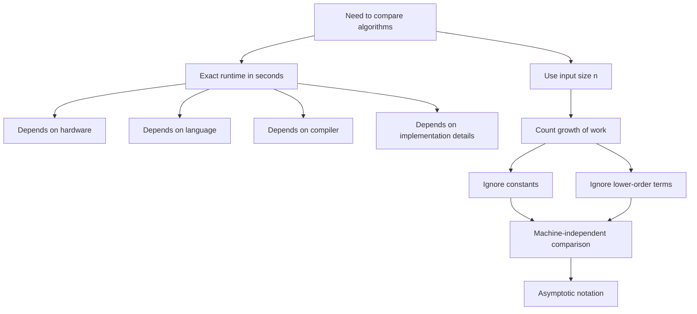
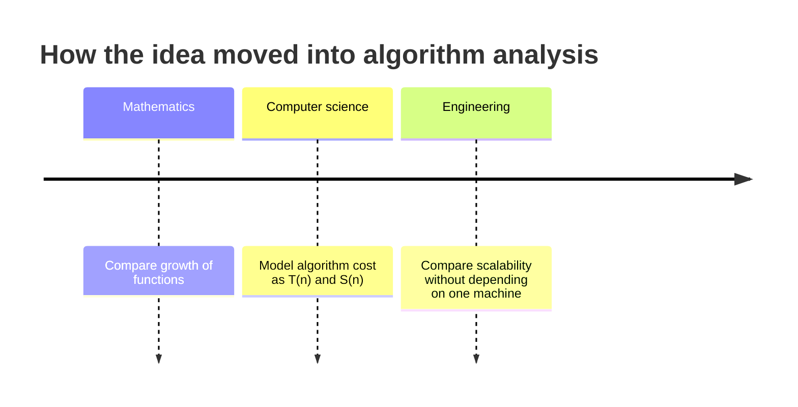
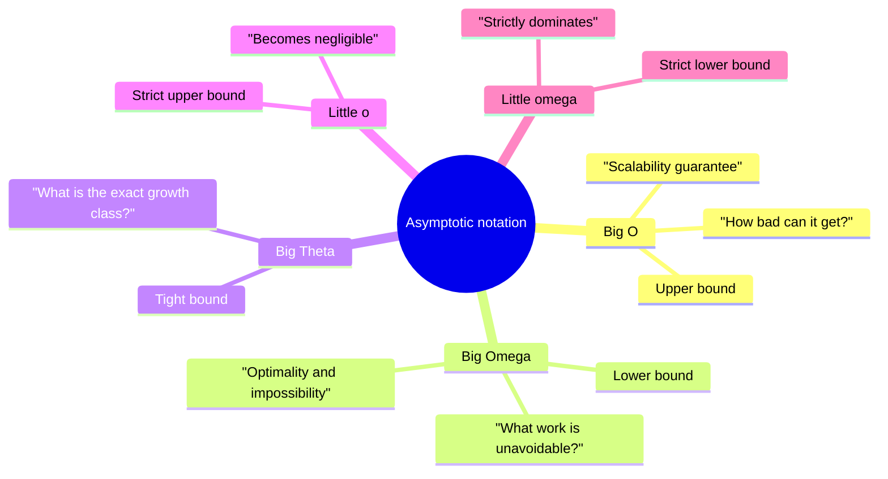
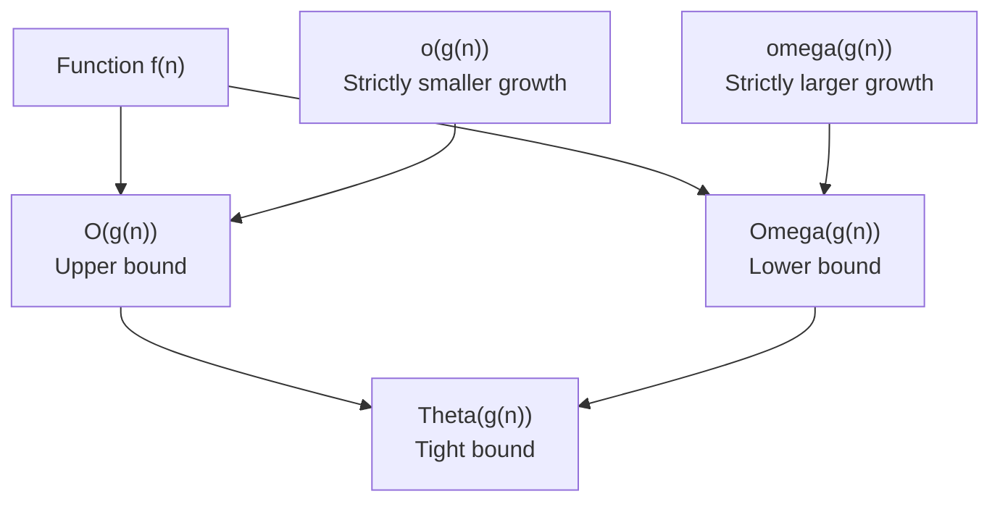
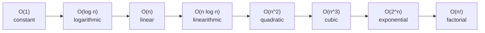
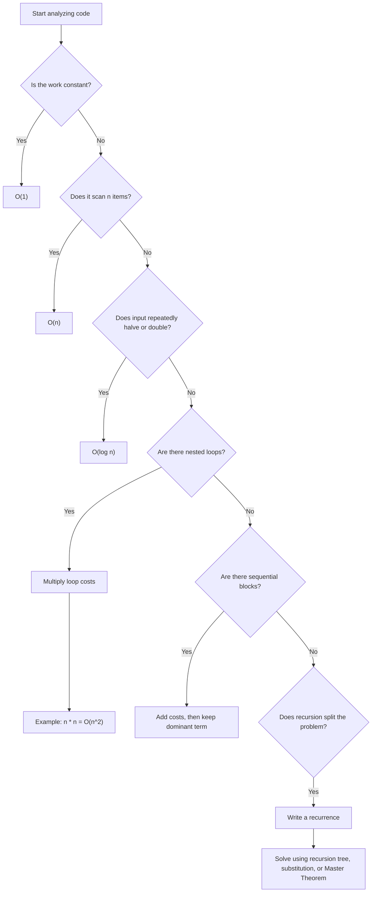
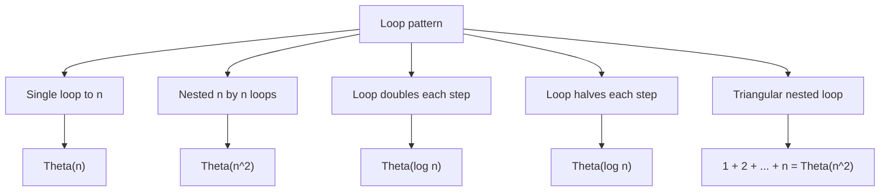
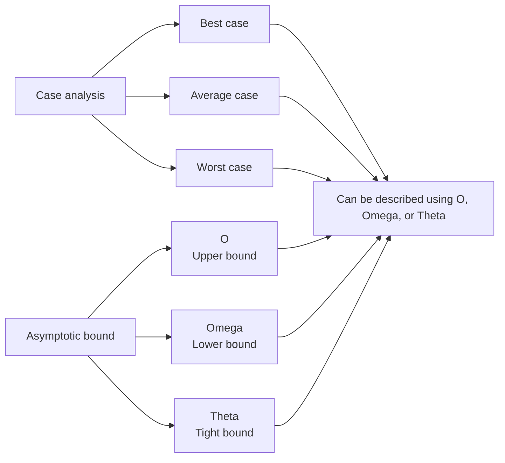
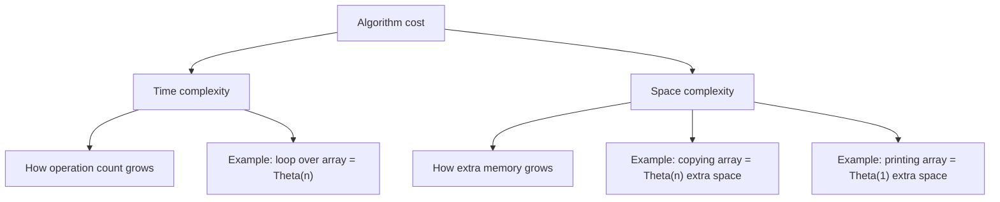
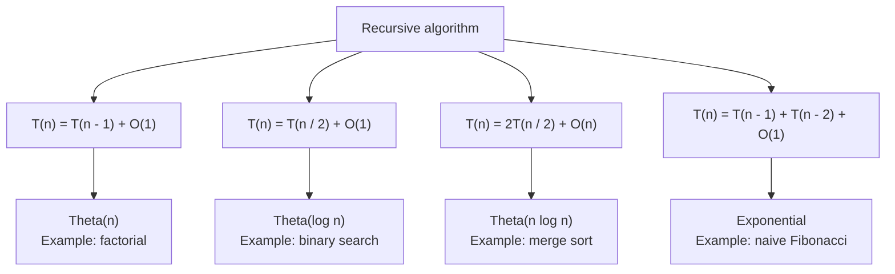

# Asymptotic Notations: Why They Exist, What They Mean, and How They Work

## 1. The Core Idea

Asymptotic notation is a mathematical way to describe how the cost of an algorithm grows when the input size becomes very large.

That cost is usually:

- Time: how many operations the algorithm performs
- Space: how much extra memory the algorithm uses
- Communication: how much data is transmitted
- I/O: how many disk or network operations happen

In data structures and algorithms, the most common use is time complexity.

Instead of asking:

> Exactly how many seconds will this program take?

asymptotic analysis asks:

> How does the required work grow as the input size grows?

For example:

```text
Input size: n

Algorithm A: T(n) = 5n + 20
Algorithm B: T(n) = n^2 + 3
```

For small inputs, Algorithm B may look acceptable. But as `n` grows, `n^2` becomes much larger than `5n + 20`.

Asymptotic notation captures that long-term growth behavior:

```text
5n + 20    grows like n
n^2 + 3    grows like n^2
```

So we say:

```text
5n + 20 = Theta(n)
n^2 + 3 = Theta(n^2)
```

The main point:

> Asymptotic notation helps compare algorithms by growth rate, not by machine-specific timing.

---

## 2. Why Asymptotic Notation Came Into Existence

### 2.1 Exact running time is too machine-dependent

Suppose two people run the same algorithm:

- One uses a fast laptop.
- One uses an old phone.
- One writes the code in C++.
- One writes the code in Python.
- One compiler optimizes the code aggressively.
- Another compiler does not.

The exact time in seconds may be very different.

But the algorithm's growth pattern usually stays the same.

For example, a linear search through an array checks elements one by one:

```text
10 elements       about 10 checks
1,000 elements    about 1,000 checks
1,000,000 items   about 1,000,000 checks
```

Different machines may run those checks faster or slower, but the work still grows linearly.

Asymptotic notation exists because computer scientists needed a way to describe algorithms independently of:

- Hardware
- Programming language
- Compiler
- Operating system
- CPU speed
- Cache behavior
- Constant implementation details

It gives a machine-independent language for algorithm growth.



---

### 2.2 Exact operation counts become messy

Consider this code:

```text
sum = 0
for i = 1 to n:
    sum = sum + i
```

An exact count may include:

- Assignment to `sum`
- Initialization of `i`
- Comparison `i <= n`
- Increment of `i`
- Addition `sum + i`
- Assignment back to `sum`
- Loop overhead

Depending on how we count, the exact number of primitive operations may be:

```text
3n + 2
5n + 4
7n + 3
```

The exact expression changes depending on the counting model.

But all of these grow linearly:

```text
3n + 2 = Theta(n)
5n + 4 = Theta(n)
7n + 3 = Theta(n)
```

So asymptotic notation removes unnecessary detail and keeps the important growth pattern.

---

### 2.3 Large inputs reveal the real difference between algorithms

For small inputs, constants matter a lot.

For example:

```text
Algorithm A: T(n) = 1000n
Algorithm B: T(n) = n^2
```

When `n = 10`:

```text
A = 1000 * 10 = 10,000
B = 10^2 = 100
```

Algorithm B is faster.

When `n = 10,000`:

```text
A = 1000 * 10,000 = 10,000,000
B = 10,000^2 = 100,000,000
```

Algorithm A is faster.

As `n` keeps growing, the linear algorithm eventually beats the quadratic algorithm permanently.

This is one of the main reasons asymptotic analysis exists:

> It studies the behavior that dominates when input size becomes large.

---

### 2.4 Constants and lower-order terms become less important

Consider:

```text
T(n) = 4n^2 + 100n + 500
```

For very large `n`, the `n^2` term dominates.

Example:

```text
n = 10:
4n^2 = 400
100n = 1,000
500 = 500

n = 1,000,000:
4n^2 = 4,000,000,000,000
100n = 100,000,000
500 = 500
```

At large scale, `4n^2` is overwhelmingly larger than the other terms.

Asymptotic notation simplifies:

```text
4n^2 + 100n + 500 = Theta(n^2)
```

It keeps the dominant term and ignores:

- Constant factors
- Smaller growth terms
- Fixed startup costs

This is useful because algorithm design is mainly concerned with the dominant growth behavior.

---

### 2.5 It gives a common language for algorithm guarantees

Without asymptotic notation, describing algorithms would be vague:

```text
This algorithm is pretty fast.
This algorithm is slow for large inputs.
This algorithm is usually okay.
```

Asymptotic notation makes the discussion precise:

```text
Binary search runs in O(log n) time.
Merge sort runs in Theta(n log n) time.
Linear search runs in O(n) time.
Hash table lookup is O(1) on average, but O(n) in the worst case.
```

That precision matters in:

- Algorithm design
- Competitive programming
- Software engineering
- Database systems
- Distributed systems
- Machine learning infrastructure
- Operating systems
- Compiler design
- Technical interviews
- Research papers

---

### 2.6 It came from mathematics before computer science used it

Asymptotic notation originally comes from mathematics, especially the study of how functions behave as their inputs approach very large values.

Mathematicians used it to compare functions without needing exact formulas in every case.

Computer science adopted the same idea because algorithm cost can also be modeled as a function:

```text
T(n) = running time for input size n
S(n) = memory used for input size n
```

So the mathematical question:

```text
How does f(n) grow as n becomes large?
```

became the algorithmic question:

```text
How does this algorithm's cost grow as the input becomes large?
```



---

## 3. What Asymptotic Notation Is

Asymptotic notation is a family of mathematical notations used to compare growth rates of functions.

In algorithms, the function is usually:

```text
T(n)
```

where:

- `T` means time cost
- `n` means input size

For example:

```text
T(n) = 2n + 5
T(n) = n^2 + n + 10
T(n) = log n
T(n) = 2^n
```

Asymptotic notation does not usually describe exact runtime. It describes the class of growth.

For example:

```text
T(n) = 3n + 10
T(n) = 50n + 1000
T(n) = n / 2
```

All are linear functions asymptotically:

```text
Theta(n)
```

They differ by constants, but they grow in the same general way.

---

## 4. What "Asymptotic" Means

The word "asymptotic" means concerned with behavior as input approaches a limit.

In algorithm analysis, the limit is usually:

```text
n -> infinity
```

That does not mean we literally run an algorithm on infinite input.

It means:

> We care about the trend that appears as input size becomes very large.

For example:

```text
T(n) = n^2 + 1000000n
```

For small and medium `n`, the `1000000n` term may dominate.

But as `n` becomes huge, `n^2` eventually dominates.

So asymptotically:

```text
n^2 + 1000000n = Theta(n^2)
```

Asymptotic analysis is about eventual behavior, not necessarily small-input behavior.

---

## 5. The Main Notations

The most important asymptotic notations are:

| Notation | Name | Meaning |
|---|---|---|
| `O(g(n))` | Big O | Upper bound |
| `Omega(g(n))` | Big Omega | Lower bound |
| `Theta(g(n))` | Big Theta | Tight bound |
| `o(g(n))` | Little o | Strict upper bound |
| `omega(g(n))` | Little omega | Strict lower bound |

Greek-symbol forms are also common:

```text
Omega = Ω
Theta = Θ
omega = ω
```

---

### 5.1 Quick practical use of each notation

Each notation answers a different type of question.

| Notation | Question it answers | Practical use |
|---|---|---|
| `O(g(n))` | How bad can growth get, at most? | Gives an upper guarantee on cost |
| `Omega(g(n))` | What amount of work is unavoidable, at least? | Proves lower bounds and impossibility results |
| `Theta(g(n))` | What is the exact growth class? | Shows upper and lower bounds match |
| `o(g(n))` | Is this strictly smaller than `g(n)`? | Shows one term becomes negligible |
| `omega(g(n))` | Is this strictly larger than `g(n)`? | Shows one term strictly dominates another |

A useful way to remember them:

```text
Big O tells you:       "This algorithm will not be worse than this bound."
Big Omega tells you:   "No solution, or this algorithm, can avoid at least this much work."
Big Theta tells you:   "This is the real asymptotic growth rate."
Little o tells you:    "This grows so much slower that it becomes insignificant."
Little omega tells you:"This grows so much faster that it eventually dominates."
```

Big Omega is useful because algorithm analysis is not only about what an algorithm can do. It is also about what no algorithm can avoid doing.

For example:

```text
Any algorithm that prints n items must take Omega(n) time.
```

Why?

Because producing `n` outputs already requires at least `n` output actions. No clever trick can print `n` separate items in fewer than proportional-to-`n` output steps.

That kind of statement is a lower bound.



---

## 6. Big O Notation

### 6.1 Meaning

Big O describes an upper bound on growth.

When we write:

```text
f(n) = O(g(n))
```

we mean:

> `f(n)` grows no faster than `g(n)`, up to a constant factor, for sufficiently large `n`.

In simpler words:

```text
f(n) is at most proportional to g(n) eventually.
```

---

### 6.2 Formal definition

`f(n) = O(g(n))` if there exist positive constants `c` and `n0` such that:

```text
0 <= f(n) <= c * g(n)
```

for every:

```text
n >= n0
```

Meaning:

- `c` handles constant factors.
- `n0` allows us to ignore small input sizes.
- The inequality only needs to hold eventually.

---

### 6.3 Example

Prove:

```text
3n + 5 = O(n)
```

We need constants `c` and `n0` such that:

```text
3n + 5 <= c * n
```

For `n >= 5`:

```text
5 <= n
```

So:

```text
3n + 5 <= 3n + n = 4n
```

Choose:

```text
c = 4
n0 = 5
```

Therefore:

```text
3n + 5 = O(n)
```

---

### 6.4 Big O is often used for worst case

In algorithm discussions, Big O is commonly used to describe a worst-case upper bound.

Example:

```text
Linear search in an array of n elements
```

Worst case:

- The target is at the end, or
- The target is not present.

The algorithm checks all `n` elements.

So:

```text
Worst-case time = O(n)
```

But be careful:

> Big O itself means upper bound. It does not automatically mean worst case.

Worst case is a type of analysis.
Big O is a type of mathematical bound.

People often combine them, but they are not the same concept.

---

### 6.5 Why Big O is useful

Big O is useful because it gives a guarantee that growth will not exceed some rate.

It helps answer questions like:

- Can this algorithm handle large input?
- What is the worst growth we should prepare for?
- Is this approach likely to scale?
- Does this algorithm have a better upper bound than another algorithm?

Example:

```text
Binary search = O(log n)
Linear search = O(n)
```

This tells us binary search has a much better upper bound for large sorted arrays.

Big O is also useful in engineering decisions:

- Estimating whether a program will survive larger input
- Comparing algorithm choices before implementation
- Finding the part of a system that dominates runtime
- Communicating performance guarantees clearly

But Big O can be loose.

For example:

```text
3n + 5 = O(n)
3n + 5 = O(n^2)
3n + 5 = O(n^10)
```

All three statements are technically true, but only `O(n)` is the most useful upper bound here.

---

## 7. Big Omega Notation

### 7.1 Meaning

Big Omega describes a lower bound on growth.

When we write:

```text
f(n) = Omega(g(n))
```

we mean:

> `f(n)` grows at least as fast as `g(n)`, up to a constant factor, for sufficiently large `n`.

In simpler words:

```text
f(n) is eventually no smaller than a constant multiple of g(n).
```

---

### 7.2 Formal definition

`f(n) = Omega(g(n))` if there exist positive constants `c` and `n0` such that:

```text
0 <= c * g(n) <= f(n)
```

for every:

```text
n >= n0
```

---

### 7.3 Example

Prove:

```text
3n + 5 = Omega(n)
```

We need constants `c` and `n0` such that:

```text
c * n <= 3n + 5
```

Choose:

```text
c = 3
n0 = 1
```

Then:

```text
3n <= 3n + 5
```

for all `n >= 1`.

Therefore:

```text
3n + 5 = Omega(n)
```

---

### 7.4 Why Big Omega is useful

Big Omega is useful because it describes work that cannot be avoided.

Big O asks:

```text
Can the algorithm be no worse than this?
```

Big Omega asks:

```text
Must the algorithm do at least this much work?
```

That second question is extremely important.

It helps answer:

- Is this algorithm asymptotically optimal?
- Can any algorithm solve this problem faster?
- What work is forced by the input size or output size?
- Is a claimed faster solution even possible?

---

#### 7.4.1 Big Omega from output size

Suppose an algorithm must print all `n` elements of an array.

Even if the algorithm is very clever, it must output `n` things.

So:

```text
Printing n items = Omega(n)
```

This lower bound comes from the output size.

No algorithm can output `n` separate items in `o(n)` time if each output action takes constant time.

---

#### 7.4.2 Big Omega from input inspection

Suppose you search for a target in an unsorted array.

Worst case:

```text
[?, ?, ?, ?, ..., ?]
```

If an algorithm skips one unchecked position, the target could be there.

So in the worst case, any correct algorithm may need to inspect every element.

Therefore:

```text
Unsorted search worst case = Omega(n)
```

Linear search also has:

```text
Unsorted search worst case = O(n)
```

So together:

```text
Unsorted search worst case = Theta(n)
```

This tells us linear search is asymptotically optimal for unsorted search.

You cannot beat linear search asymptotically unless you add extra structure, such as sorting, hashing, or indexing.

---

#### 7.4.3 Big Omega proves limits, not just algorithm speed

Big O is often about a specific algorithm.

Example:

```text
Merge sort runs in O(n log n)
```

Big Omega can describe a whole problem.

Example:

```text
Any comparison-based sorting algorithm requires Omega(n log n) comparisons in the worst case.
```

This is stronger than saying one algorithm is slow or fast.

It says every comparison-based sorting algorithm faces that lower bound.

Because merge sort has:

```text
O(n log n)
```

and comparison sorting has lower bound:

```text
Omega(n log n)
```

we can conclude:

```text
Merge sort is asymptotically optimal among comparison-based sorting algorithms.
```

That is one of the biggest uses of Big Omega.

---

#### 7.4.4 Big Omega helps prove Big Theta

To prove a tight bound, we need both sides:

```text
Upper bound: f(n) = O(g(n))
Lower bound: f(n) = Omega(g(n))
```

Then:

```text
f(n) = Theta(g(n))
```

So Big Omega is useful because it completes the proof that a bound is tight.

Without Big Omega, we may only know that an algorithm is no worse than some function. We would not know whether that function is the true growth rate.

---

#### 7.4.5 When Big Omega feels less useful

Big Omega can feel less useful at first because programmers often want upper guarantees:

```text
Will my program finish within this much time?
```

That is a Big O-style question.

Big Omega answers a different kind of question:

```text
What cost is unavoidable?
```

So Big Omega becomes more useful when you study:

- Optimality
- Lower-bound proofs
- Algorithm impossibility
- Problem difficulty
- Whether further optimization is theoretically possible

---

## 8. Big Theta Notation

### 8.1 Meaning

Big Theta describes a tight bound.

When we write:

```text
f(n) = Theta(g(n))
```

we mean:

> `f(n)` grows at the same asymptotic rate as `g(n)`.

In simpler words:

```text
f(n) is bounded above and below by constant multiples of g(n).
```

---

### 8.2 Formal definition

`f(n) = Theta(g(n))` if there exist positive constants `c1`, `c2`, and `n0` such that:

```text
0 <= c1 * g(n) <= f(n) <= c2 * g(n)
```

for every:

```text
n >= n0
```

---

### 8.3 Relation to Big O and Big Omega

This is the most important relationship:

```text
f(n) = Theta(g(n))
```

if and only if:

```text
f(n) = O(g(n))
and
f(n) = Omega(g(n))
```

So:

```text
Theta = upper bound + lower bound
```



---

### 8.4 Example

Prove:

```text
3n + 5 = Theta(n)
```

We already showed:

```text
3n + 5 = O(n)
3n + 5 = Omega(n)
```

Therefore:

```text
3n + 5 = Theta(n)
```

---

### 8.5 Why Big Theta is useful

Big Theta is useful because it gives the exact asymptotic growth class.

Big O alone may be too broad.

Example:

```text
3n + 5 = O(n)
3n + 5 = O(n^2)
3n + 5 = O(2^n)
```

All are true upper bounds, but they do not all describe the real growth accurately.

The tight statement is:

```text
3n + 5 = Theta(n)
```

Big Theta is the clearest answer when we know the growth precisely.

It helps answer:

- What is the actual growth rate?
- Is the upper bound tight?
- Does the algorithm really behave like this function?
- Did we overestimate the algorithm with a loose Big O bound?

In practice, when someone asks:

```text
What is the time complexity of this algorithm?
```

the best answer is often a Big Theta bound if it is known.

---

## 9. Little o Notation

### 9.1 Meaning

Little `o` describes a strict upper bound.

When we write:

```text
f(n) = o(g(n))
```

we mean:

> `f(n)` grows strictly slower than `g(n)`.

This is stronger than Big O.

Example:

```text
n = O(n)
```

is true.

But:

```text
n = o(n)
```

is false.

Because `n` does not grow strictly slower than itself.

However:

```text
n = o(n^2)
```

is true.

---

### 9.2 Limit definition

`f(n) = o(g(n))` if:

```text
lim n->infinity f(n) / g(n) = 0
```

Example:

```text
f(n) = n
g(n) = n^2
```

Then:

```text
f(n) / g(n) = n / n^2 = 1 / n
```

And:

```text
lim n->infinity 1 / n = 0
```

Therefore:

```text
n = o(n^2)
```

---

### 9.3 Why little o is useful

Little `o` is useful when we need to say that one function becomes negligible compared with another.

Big O allows equality of growth class:

```text
n = O(n)
```

Little `o` does not:

```text
n != o(n)
```

So little `o` is stricter.

Examples:

```text
log n = o(n)
n = o(n log n)
n log n = o(n^2)
n^2 = o(2^n)
```

This is useful in more advanced analysis because it lets us say:

```text
The smaller term eventually becomes insignificant compared with the larger term.
```

Example:

```text
T(n) = n^2 + n
```

Here:

```text
n = o(n^2)
```

So the linear term is asymptotically negligible compared with the quadratic term.

That is why:

```text
n^2 + n = Theta(n^2)
```

Little `o` is common in mathematical proofs, research papers, and detailed algorithm analysis. It is less common in beginner coding interviews, but it is still conceptually important.

---

## 10. Little omega Notation

### 10.1 Meaning

Little `omega` describes a strict lower bound.

When we write:

```text
f(n) = omega(g(n))
```

we mean:

> `f(n)` grows strictly faster than `g(n)`.

Example:

```text
n^2 = omega(n)
```

because `n^2` grows strictly faster than `n`.

---

### 10.2 Limit definition

`f(n) = omega(g(n))` if:

```text
lim n->infinity f(n) / g(n) = infinity
```

Example:

```text
f(n) = n^2
g(n) = n
```

Then:

```text
f(n) / g(n) = n^2 / n = n
```

And:

```text
lim n->infinity n = infinity
```

Therefore:

```text
n^2 = omega(n)
```

---

### 10.3 Why little omega is useful

Little `omega` is useful when we need to say that one function grows strictly faster than another.

Big Omega allows equality of growth class:

```text
n = Omega(n)
```

Little `omega` does not:

```text
n != omega(n)
```

So little `omega` is stricter.

Examples:

```text
n = omega(log n)
n log n = omega(n)
n^2 = omega(n log n)
2^n = omega(n^100)
```

This is useful when proving dominance.

For example:

```text
n^2 + n
```

The `n^2` term strictly dominates the `n` term because:

```text
n^2 = omega(n)
```

So for large input, the behavior is controlled by `n^2`, not by `n`.

Little `omega` is also useful when showing that an algorithm or function is not merely at least as large as another, but grows strictly faster.

---

## 11. Growth Rates from Fastest to Slowest

Here is a common ordering:

```text
O(1)
O(log n)
O(sqrt(n))
O(n)
O(n log n)
O(n^2)
O(n^3)
O(2^n)
O(n!)
```



From better scalability to worse scalability:

| Complexity | Name | Common example |
|---|---|---|
| `O(1)` | Constant | Array index access |
| `O(log n)` | Logarithmic | Binary search |
| `O(n)` | Linear | Linear search |
| `O(n log n)` | Linearithmic | Merge sort, heap sort |
| `O(n^2)` | Quadratic | Simple nested loops |
| `O(n^3)` | Cubic | Naive matrix multiplication |
| `O(2^n)` | Exponential | Brute-force subsets |
| `O(n!)` | Factorial | Brute-force permutations |

Important:

> A lower asymptotic growth rate is usually better for large inputs.

But "usually" matters because constants, memory usage, cache behavior, and input size can still affect real-world performance.

---

## 12. How to Analyze Code Using Asymptotic Notation

Use this decision flow as a first pass. After that, check the exact code carefully because mixed loops, recursion, and multiple variables can change the answer.



### 12.1 Single loop

```text
for i = 1 to n:
    print(i)
```

The loop runs `n` times.

Each iteration takes constant time.

So:

```text
T(n) = c * n
T(n) = Theta(n)
```

---

### 12.2 Nested loops

```text
for i = 1 to n:
    for j = 1 to n:
        print(i, j)
```

The outer loop runs `n` times.

For each outer iteration, the inner loop runs `n` times.

Total:

```text
n * n = n^2
```

So:

```text
T(n) = Theta(n^2)
```

---

### 12.3 Sequential loops

```text
for i = 1 to n:
    print(i)

for j = 1 to n:
    print(j)
```

First loop:

```text
Theta(n)
```

Second loop:

```text
Theta(n)
```

Total:

```text
Theta(n) + Theta(n) = Theta(2n) = Theta(n)
```

So:

```text
T(n) = Theta(n)
```

---

### 12.4 Different input sizes

```text
for i = 1 to n:
    print(i)

for j = 1 to m:
    print(j)
```

The first loop depends on `n`.
The second loop depends on `m`.

So:

```text
T(n, m) = Theta(n + m)
```

Do not incorrectly simplify this to `Theta(n)` unless you know that `m` grows like `n`.

---

### 12.5 Loop that doubles

```text
i = 1
while i < n:
    print(i)
    i = i * 2
```

Values of `i`:

```text
1, 2, 4, 8, 16, ...
```

After `k` iterations:

```text
i = 2^k
```

The loop stops when:

```text
2^k >= n
```

Taking logarithm:

```text
k >= log2(n)
```

So:

```text
T(n) = Theta(log n)
```

---

### 12.6 Loop that halves

```text
while n > 1:
    n = n / 2
```

The value of `n` is repeatedly divided by 2.

Number of iterations:

```text
Theta(log n)
```

This pattern appears in:

- Binary search
- Heap operations
- Balanced binary search trees
- Divide-and-conquer algorithms

---

### 12.7 Triangular nested loop

```text
for i = 1 to n:
    for j = 1 to i:
        print(i, j)
```

The inner loop runs:

```text
1 + 2 + 3 + ... + n
```

This sum is:

```text
n(n + 1) / 2
```

Expanding:

```text
(n^2 + n) / 2
```

Dominant term:

```text
n^2
```

So:

```text
T(n) = Theta(n^2)
```

Even though the inner loop does not always run `n` times, the total growth is still quadratic.



---

### 12.8 Divide and conquer

Example:

```text
mergeSort(array):
    split array into two halves
    mergeSort(left half)
    mergeSort(right half)
    merge the two sorted halves
```

At each level of recursion:

- Total merge work is `Theta(n)`.
- Number of levels is `Theta(log n)`.

So:

```text
T(n) = Theta(n log n)
```

---

## 13. Common Algorithm Examples

### 13.1 Array access

```text
arr[i]
```

Accessing an array element by index takes constant time because the memory address can be computed directly.

```text
T(n) = O(1)
```

---

### 13.2 Linear search

```text
for each item in array:
    if item == target:
        return true
return false
```

Best case:

```text
Theta(1)
```

The target is first.

Worst case:

```text
Theta(n)
```

The target is last or missing.

Average case:

```text
Theta(n)
```

On average, we still scan a linear number of elements.

---

### 13.3 Binary search

Binary search repeatedly halves the search space.

```text
T(n) = Theta(log n)
```

But it requires sorted data.

---

### 13.4 Bubble sort

Bubble sort repeatedly compares adjacent elements.

Common worst-case time:

```text
Theta(n^2)
```

With an early-exit optimization, best case can be:

```text
Theta(n)
```

when the array is already sorted.

---

### 13.5 Merge sort

Merge sort divides the array and merges sorted halves.

```text
T(n) = Theta(n log n)
```

It also commonly needs extra memory:

```text
S(n) = Theta(n)
```

---

### 13.6 Hash table lookup

Average case:

```text
O(1)
```

Worst case:

```text
O(n)
```

The worst case can happen when many keys collide into the same bucket.

Good hash functions and resizing make the average case very efficient.

---

## 14. Best Case, Average Case, and Worst Case

Asymptotic notation and case analysis are different concepts.

Case analysis describes the input situation:

| Case | Meaning |
|---|---|
| Best case | Most favorable input |
| Average case | Expected input under some probability model |
| Worst case | Most unfavorable input |

Asymptotic notation describes the mathematical bound:

| Notation | Meaning |
|---|---|
| `O` | Upper bound |
| `Omega` | Lower bound |
| `Theta` | Tight bound |

They can be combined:

```text
Worst-case time is O(n^2).
Best-case time is Omega(n).
Average-case time is Theta(n log n).
```



Important mistake to avoid:

> Big O does not mean worst case by definition.

Big O is often used for worst-case analysis, but it is not the same thing.

---

## 15. Why We Drop Constants

Consider:

```text
T1(n) = n
T2(n) = 100n
```

Technically, `T2` does 100 times more work.

But both grow linearly:

```text
T1(n) = Theta(n)
T2(n) = Theta(n)
```

Why ignore the factor 100?

Because asymptotic analysis focuses on growth class.

For very large input, growth class usually matters more than constant factor.

Compare:

```text
100n       versus       n^2
```

At first, `n^2` may be smaller.

But eventually, `n^2` becomes larger and keeps growing faster.

Still, constants are not useless. In real systems:

- `O(n)` with a huge constant may be slower than `O(n log n)` for practical input sizes.
- Cache behavior can dominate performance.
- Memory allocation can be expensive.
- Network calls can dwarf CPU operations.

So asymptotic notation is not a replacement for benchmarking. It is a tool for understanding scalability.

---

## 16. Why We Drop Lower-Order Terms

Consider:

```text
T(n) = n^3 + 100n^2 + 5000n + 999
```

The dominant term is:

```text
n^3
```

So:

```text
T(n) = Theta(n^3)
```

Why?

Because:

```text
n^3
```

eventually grows much faster than:

```text
n^2
n
constant terms
```

As `n` approaches infinity, the highest-order term dominates.

---

## 17. Using Limits to Compare Growth

A powerful way to compare `f(n)` and `g(n)` is to examine:

```text
lim n->infinity f(n) / g(n)
```

### 17.1 If the limit is 0

Then `f(n)` grows strictly slower than `g(n)`.

```text
f(n) = o(g(n))
```

Example:

```text
n / n^2 = 1 / n -> 0
```

So:

```text
n = o(n^2)
```

---

### 17.2 If the limit is a positive constant

Then they grow at the same asymptotic rate.

```text
f(n) = Theta(g(n))
```

Example:

```text
(3n + 5) / n = 3 + 5/n -> 3
```

So:

```text
3n + 5 = Theta(n)
```

---

### 17.3 If the limit is infinity

Then `f(n)` grows strictly faster than `g(n)`.

```text
f(n) = omega(g(n))
```

Example:

```text
n^2 / n = n -> infinity
```

So:

```text
n^2 = omega(n)
```

---

## 18. Logarithms in Asymptotic Analysis

In asymptotic notation, the base of a logarithm usually does not matter.

Why?

Because of the change-of-base formula:

```text
log_a(n) = log_b(n) / log_b(a)
```

The value:

```text
1 / log_b(a)
```

is a constant.

Since asymptotic notation ignores constant factors:

```text
log_2(n) = Theta(log_10(n))
```

So we often write:

```text
O(log n)
```

without specifying the base.

---

## 19. Polynomial Growth vs Exponential Growth

Polynomial growth:

```text
n
n^2
n^3
n^10
```

Exponential growth:

```text
2^n
3^n
10^n
```

Exponential growth eventually beats any fixed-degree polynomial.

For example:

```text
n^100 = O(2^n)
```

Even though `n^100` is enormous for many values of `n`, `2^n` eventually grows faster.

This is why exponential-time algorithms become impractical quickly.

---

## 20. Space Complexity

Asymptotic notation is not only for time.

It also describes memory growth.



Example:

```text
function printArray(arr):
    for item in arr:
        print(item)
```

Time:

```text
Theta(n)
```

Extra space:

```text
Theta(1)
```

The algorithm processes `n` items but does not create another array of size `n`.

Now consider:

```text
function copyArray(arr):
    newArr = []
    for item in arr:
        newArr.append(item)
    return newArr
```

Time:

```text
Theta(n)
```

Extra space:

```text
Theta(n)
```

Because it creates a new array of size `n`.

---

## 21. Recursive Algorithms

Recursive algorithms often lead to recurrence relations.



### 21.1 Factorial

```text
factorial(n):
    if n == 0:
        return 1
    return n * factorial(n - 1)
```

There is one recursive call for each value from `n` down to `0`.

Time:

```text
Theta(n)
```

Call stack space:

```text
Theta(n)
```

---

### 21.2 Binary search recurrence

Binary search checks the middle element and continues on half the array.

Recurrence:

```text
T(n) = T(n/2) + O(1)
```

The input halves each time.

So:

```text
T(n) = Theta(log n)
```

---

### 21.3 Merge sort recurrence

Merge sort solves two half-size problems and then merges.

Recurrence:

```text
T(n) = 2T(n/2) + O(n)
```

The result:

```text
T(n) = Theta(n log n)
```

---

### 21.4 Naive Fibonacci recurrence

```text
fib(n):
    if n <= 1:
        return n
    return fib(n - 1) + fib(n - 2)
```

This recomputes the same subproblems many times.

The time is exponential:

```text
T(n) = O(2^n)
```

With dynamic programming, it can be reduced to:

```text
Theta(n)
```

---

## 22. Amortized Analysis

Sometimes one operation is occasionally expensive, but the average cost over many operations is small.

Example: dynamic array append.

Usually, appending is constant time:

```text
O(1)
```

But when the array is full, it must:

- Allocate a larger array
- Copy old elements
- Insert the new element

That resize operation costs:

```text
O(n)
```

However, resizing does not happen on every append.

Across many appends, the average cost per append is:

```text
O(1) amortized
```

Amortized analysis explains why dynamic arrays are efficient despite occasional expensive resizing.

---

## 23. Common Rules for Simplifying Complexity

### 23.1 Drop constants

```text
O(5n) = O(n)
O(100) = O(1)
```

---

### 23.2 Drop lower-order terms

```text
O(n^2 + n + 1) = O(n^2)
O(n log n + n) = O(n log n)
```

---

### 23.3 Sequential blocks add

```text
O(f(n)) + O(g(n)) = O(f(n) + g(n))
```

Then keep the dominant term.

Example:

```text
O(n) + O(n^2) = O(n^2)
```

---

### 23.4 Nested loops multiply

If one loop of `n` iterations contains another loop of `m` iterations:

```text
O(n * m)
```

If both depend on `n`:

```text
O(n * n) = O(n^2)
```

---

### 23.5 Repeated halving usually means logarithmic

```text
n, n/2, n/4, n/8, ...
```

This pattern usually gives:

```text
O(log n)
```

---

### 23.6 Generating all subsets is exponential

A set of `n` elements has:

```text
2^n
```

subsets.

So algorithms that check every subset are usually:

```text
O(2^n)
```

---

### 23.7 Generating all permutations is factorial

A set of `n` distinct elements has:

```text
n!
```

permutations.

So algorithms that check every ordering are usually:

```text
O(n!)
```

---

## 24. Common Mistakes

### 24.1 Thinking Big O always means worst case

Incorrect:

```text
Big O means worst case.
```

Correct:

```text
Big O means upper bound.
```

You can discuss:

```text
Worst-case O(n)
Average-case O(n)
Best-case O(1)
```

---

### 24.2 Ignoring different variables

Incorrect:

```text
O(n + m) = O(n)
```

This is only valid if `m` is known to be bounded by `n` or grows like `n`.

Otherwise:

```text
O(n + m)
```

should stay as it is.

---

### 24.3 Saying all constants never matter

Asymptotic notation ignores constants for growth analysis.

But constants can matter in real performance.

Example:

```text
O(n)
```

with expensive network calls can be slower than:

```text
O(n log n)
```

with simple in-memory operations for realistic input sizes.

---

### 24.4 Confusing recursion depth with total work

Binary search has recursion depth:

```text
O(log n)
```

Merge sort also has recursion depth:

```text
O(log n)
```

But merge sort's total time is:

```text
O(n log n)
```

because each recursion level does total `O(n)` merge work.

---

### 24.5 Assuming nested loops always mean O(n^2)

Nested loops often mean quadratic time, but not always.

Example:

```text
for i = 1 to n:
    j = 1
    while j < n:
        j = j * 2
```

Outer loop:

```text
n
```

Inner loop:

```text
log n
```

Total:

```text
O(n log n)
```

---

## 25. Practical Interpretation

Asymptotic notation tells you scalability, not exact runtime.

Use it to answer:

- Will this algorithm survive if input grows 10 times?
- Is the current approach fundamentally scalable?
- Which part of the algorithm dominates?
- Is a better algorithmic strategy needed?

Do not use it alone to answer:

- Which implementation is faster for 100 items?
- How many milliseconds will this take?
- What is the exact memory usage?
- Will this be fast enough in production?

For real systems, combine asymptotic analysis with:

- Benchmarking
- Profiling
- Memory measurement
- Cache-awareness
- Database query analysis
- Network latency analysis
- Workload-specific testing

---

## 26. Mental Model

A simple mental model:

```text
Big O       = will not grow faster than this
Big Omega   = will not grow slower than this
Big Theta   = grows exactly like this, asymptotically
little o    = grows strictly slower than this
little omega= grows strictly faster than this
```

Another way:

```text
O       = <= up to constants
Omega   = >= up to constants
Theta   = = up to constants
o       = strictly <
omega   = strictly >
```

---

## 27. Final Summary

Asymptotic notation exists because exact runtime is too dependent on hardware, language, compiler, and implementation details.

It gives a mathematical way to describe how an algorithm's cost grows as input size becomes large.

The key notations are:

```text
O(g(n))        upper bound
Omega(g(n))    lower bound
Theta(g(n))    tight bound
o(g(n))        strict upper bound
omega(g(n))    strict lower bound
```

The practical goal is to understand scalability.

For example:

```text
O(1)       excellent scaling
O(log n)   very good scaling
O(n)       usually acceptable
O(n log n) common for efficient sorting
O(n^2)     can become slow for large n
O(2^n)     usually impractical for large n
O(n!)      usually impractical even faster
```

The most important lesson:

> Asymptotic notation does not tell you exact speed. It tells you how speed changes as the problem grows.
